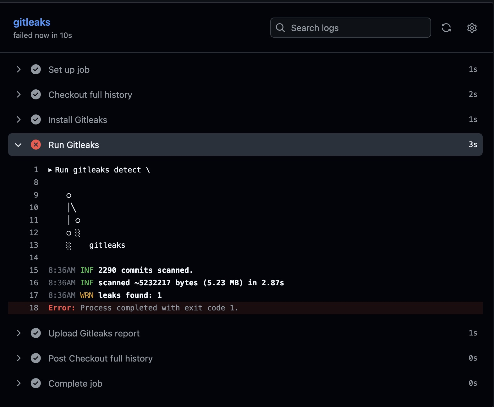
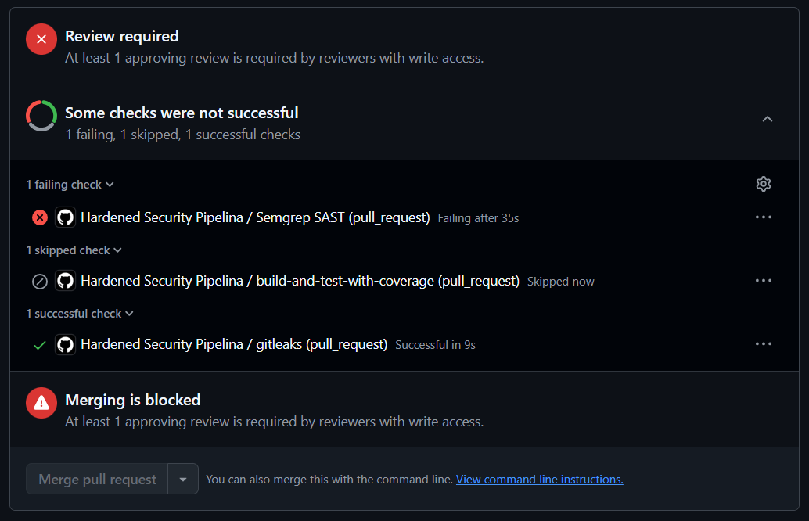
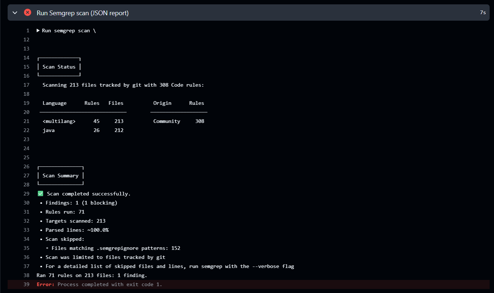
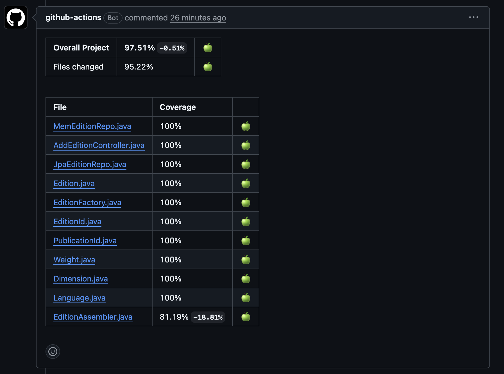
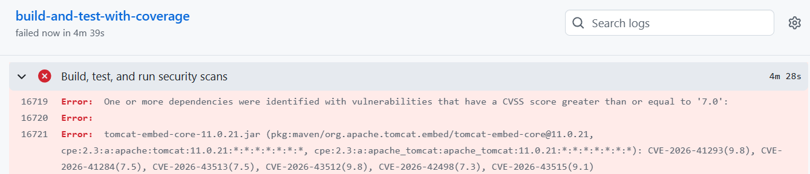

# MiteLovers

A second-hand book and magazine marketplace built with Java and Spring Boot, developed as part of the SwitchDev LABPROJ 25/26 programme.

---

## Prerequisites

- Java 21
- Maven 3.8+

---

## Table of contents

<!-- TOC -->
* [MiteLovers](#mitelovers)
  * [Prerequisites](#prerequisites)
  * [Table of contents](#table-of-contents)
  * [Build, Test and Run](#build-test-and-run)
  * [DevSecOps Workflow](#devsecops-workflow)
    * [Branching Strategy](#branching-strategy)
    * [Development Flow](#development-flow)
    * [Quality Gates](#quality-gates)
  * [Test Coverage](#test-coverage)
  * [CI Pipeline](#ci-pipeline)
    * [Notify Discord on PR Creation](#notify-discord-on-pr-creation)
    * [Notify Discord on PR Merge](#notify-discord-on-pr-merge)
    * [Hardened Security Pipeline](#hardened-security-pipeline)
      * [Secret Detection with Gitleaks](#secret-detection-with-gitleaks)
      * [Static Code Analysis and Security Checks with Semgrep](#static-code-analysis-and-security-checks-with-semgrep)
      * [Run Tests on Pull Request](#run-tests-on-pull-request)
      * [Dependency Inventory (SBOM) and Scanning (SCA - OWASP Dependency-Check)](#dependency-inventory-sbom-and-scanning-sca---owasp-dependency-check)
  * [SpringBoot application.properties](#springboot-applicationproperties)
<!-- TOC -->

___


## Build, Test and Run

To compile, build and run all tests of the application:

```bash
mvn clean verify
```

To run tests only:

```bash
mvn clean test
```

To run the application locally, there are two options.

**Option 1:**

macOs/Linux:
```bash
mvn spring-boot:run -Dspring-boot.run.profiles=mem
```

Windows:
```
mvn spring-boot:run "-Dspring-boot.run.profiles=mem"
```

- starts the app using an in-memory profile, meaning the database lives only in RAM and is wiped clean every time the app stops (Assuming tha the JDBC URL in `application.properties` is set to `jdbc:h2:mem:miteloversdb`).

**Option 2:**

macOs/Linux:
```bash
mvn spring-boot:run -Dspring-boot.run.profiles=jpa,bootstrap
```

Windows:
```
mvn spring-boot:run "-Dspring-boot.run.profiles=jpa,bootstrap"
```

- starts the app with two profiles: jpa for file/persistent database configuration, and bootstrap to seed initial data on startup. Data survives restarts.

The application will start on `http://localhost:8081`.

The H2 console is available at `http://localhost:8081/h2-console` with the following settings:
- JDBC URL: `jdbc:h2:file:./data/miteloversdb`
- Username: `sa`
- Password: *(leave blank)*

---

## DevSecOps Workflow

### Branching Strategy
- `b3` and `b4` are the main integration branches;
- Feature branches are created from `b3` or `b4` depending on the work assigned to each team member;
- All changes are integrated via Pull Requests;
- Direct pushes to `b3` and `b4` are reserved for exceptional cases;
- Direct pushes to `main` are not allowed.


### Development Flow
1. Create a feature branch from `b3` or `b4`;
2. Develop and commit following the convention: `[feat|fix|refactor|docs|config]: description closes #issue`;
3. Open a Pull Request targeting `b3` or `b4`;
4. CI pipeline runs automatically — all checks must pass;
5. Code is reviewed and merged.

### Quality Gates
- All tests must pass;
- Build must succeed with `mvn clean verify`.
- JaCoCo instruction coverage must be ≥ 95%;

---

## Test Coverage

It was decided to link the coverage threshold to the `mvn verify` stage, with JaCoCo configured to enforce a minimum instruction coverage of **95%**.

For that we updated the JaCoCo plugin in the pom.xml:

```xml
<plugins>
    <!-- JaCoCo (coverage) -->
    <plugin>
        <groupId>org.jacoco</groupId>
        <artifactId>jacoco-maven-plugin</artifactId>
        <version>${jacoco.version}</version>
        <executions>
            <execution>
                <goals>
                    <goal>prepare-agent</goal>
                </goals>
            </execution>
            <execution>
                <id>report</id>
                <goals>
                    <goal>report</goal>
                </goals>
            </execution>
            <!-- Verifies that coverage is higher than 95% -->
            <execution>
                <id>check-coverage</id>
                <phase>verify</phase>
                <goals><goal>check</goal></goals>
                <configuration>
                    <rules>
                        <rule>
                            <element>BUNDLE</element>
                            <limits>
                                <limit>
                                    <counter>LINE</counter>
                                    <value>COVEREDRATIO</value>
                                    <minimum>0.95</minimum>
                                </limit>
                            </limits>
                        </rule>
                    </rules>
                </configuration>
            </execution>
        </executions>
    </plugin>
</plugins>
```

This sets several goals:

- `<phase>verify</phase>` binds this execution to the `verify` phase, so it runs and enforces the coverage whenever `mvn verify` is run;
- `<goal>check</goal>` tells JaCoCo to check coverage against the rules;
- `<counter>LINE</counter>` measures line coverage;
- `<value>COVEREDRATIO</value>` uses ratio (0.0 to 1.0);
- `<minimum>0.95</minimum>` enforces 95% minimum, failing the build if coverage drops below that.

The build will fail automatically if coverage drops below this threshold, blocking any non-compliant code from being integrated.

To generate the coverage report locally:

```bash
mvn clean verify
```

The HTML report is available at `target/site/jacoco/index.html`.

___

## CI Pipeline

The project uses GitHub Actions for continuous integration.

The pipeline triggers automatically on:
- Every push to `main`, `b3`, or `b4`
- Every pull request targeting `main`, `b3`, or `b4`

For that, we defined three different GitHub worflows:
  - Notify Discord on PR Creation
  - Notify Discord on PR Merge
  - Hardened Security Pipeline

___

### Notify Discord on PR Creation

This workflow sends an automated message triggered by any pull request to the teams Discord channel. 

The objective is to notify the existence of a new PR, so that the team can assingn reviewers to it:

```yaml
name: Notify Discord on PR Creation

on:
  pull_request:
    types: [opened, reopened]

jobs:
  notify:
    runs-on: ubuntu-latest

    steps:
      - name: Send message to Discord
        run: |
          curl -H "Content-Type: application/json" \
          -d "$(jq -n \
            --arg title "${{ github.event.pull_request.title }}" \
            --arg user "${{ github.event.pull_request.user.login }}" \
            --arg url "${{ github.event.pull_request.html_url }}" \
            --arg number "${{ github.event.pull_request.number }}" \
            --arg base "${{ github.event.pull_request.base.ref }}" \
            '{
              content: (
                "📢 New Pull Request #" + $number + "to merge into " + $base  "\n" +
                "🏷️ " + $title + "\n" +
                "👤 " + $user + "\n" +
                "🌐 " + $url
              )
            }')" \
          ${{ secrets.DISCORD_INCOMING_PR_WEBHOOK }}
```

---

### Notify Discord on PR Merge

This GitHub workflow presents a complementary action to the first one.

It is triggered whenever a Pull Request is merged on a certain branch and notifies the team to integrate these new changes in their local working branches:

```yaml
name: Notify Discord on PR Merge

on:
  pull_request:
    types: [closed]

jobs:
  notify:
    if: github.event.pull_request.merged == true
    runs-on: ubuntu-latest


    steps:
      - name: Send message to Discord
        run: |
          curl -H "Content-Type: application/json" \
          -d "$(jq -n \
            --arg title "${{ github.event.pull_request.title }}" \
            --arg user "${{ github.event.pull_request.user.login }}" \
            --arg url "${{ github.event.pull_request.html_url }}" \
            --arg number "${{ github.event.pull_request.number }}" \
            --arg base "${{ github.event.pull_request.base.ref }}" \
            '{
              content: (
                "🚀 PR #" + $number + " merged to " + $base + "\n" +
                "🏷️ " + $title + "\n" +
                "👤 " + $user + "\n" +
                "🌐 " + $url + "\n\n" +
                "🚨 Please update your branches!"
              )
            }')" \
          ${{ secrets.DISCORD_WEBHOOK }}
```
---
### Hardened Security Pipeline

This workflow, comprised of several jobs, seeks to enforce a propper running order for several tasks.

Its consists of the following jobs: 
  - `gitleaks`: ensures secret detection
  - `semgrep-sast`: implements a SAST scan
  - `build-and-test-with-coverage`: build + tests + JaCoCo coverage + OWASP Dependency-Check (SCA) + SBOM generation


The full pipeline is configured as follows:
```yaml
name: Hardened Security Pipeline

on:
  pull_request:
    branches:
      - main
      - b3
      - b4

env:
  FORCE_JAVASCRIPT_ACTIONS_TO_NODE24: true

jobs:
  gitleaks:
    runs-on: ubuntu-latest

    steps:
      - name: Checkout full history
        uses: actions/checkout@v4
        with:
          fetch-depth: 0

      - name: Install Gitleaks
        run: |
          wget https://github.com/gitleaks/gitleaks/releases/download/v8.27.2/gitleaks_8.27.2_linux_x64.tar.gz
          tar -xzf gitleaks_8.27.2_linux_x64.tar.gz
          sudo mv gitleaks /usr/local/bin/
          gitleaks version

      - name: Run Gitleaks
        run: |
          gitleaks detect \
            --source . \
            --report-format json \
            --report-path gitleaks-report.json \
            --exit-code 1

      - name: Upload Gitleaks report
        if: always()
        uses: actions/upload-artifact@v4
        with:
          name: gitleaks-report
          path: gitleaks-report.json

  semgrep-sast:
    name: Semgrep SAST
    runs-on: ubuntu-latest
    needs: gitleaks

    container:
      image: semgrep/semgrep

    permissions:
      contents: read
      security-events: write

    steps:
      - name: Checkout repository
        uses: actions/checkout@v4

      - name: Run Semgrep scan (JSON report)
        run: |
          semgrep scan \
            --config=auto \
            --config p/java \
            --json --output semgrep-report.json \
            --severity ERROR \
            --error \
            src/ 

      - name: Upload Semgrep JSON report
        uses: actions/upload-artifact@v4.6.2
        with:
          name: semgrep-sast-report
          path: semgrep-report.json

  build-and-test-with-coverage:
    runs-on: ubuntu-latest
    needs: semgrep-sast

    permissions:
      contents: read
      pull-requests: write

    env:
      NVD_API_KEY: ${{ secrets.NVD_API_KEY }}

    steps:
      - name: Checkout code
        uses: actions/checkout@v4.2.2
      - name: Set up JDK 21
        uses: actions/setup-java@v4.7.0
        with:
          distribution: temurin
          java-version: '21'
          cache: maven
      - name: Build, test, and run security scans
        run: mvn clean verify
      - name: Upload JaCoCo coverage report
        if: always()
        uses: actions/upload-artifact@v4.6.2
        with:
          name: jacoco-report
          path: target/site/jacoco/
      - name: Upload Dependency-Check report
        if: always()
        uses: actions/upload-artifact@v4.6.2
        with:
          name: dependency-check-report
          path: target/dependency-check-report.html
      - name: Upload SBOM
        if: always()
        uses: actions/upload-artifact@v4.6.2
        with:
          name: sbom-cyclonedx
          path: target/bom.xml
      - name: Post coverage comment
        if: always()
        uses: madrapps/jacoco-report@v1.7.1
        with:
          paths: ${{ github.workspace }}/target/site/jacoco/jacoco.xml
          token: ${{ secrets.GITHUB_TOKEN }}
          min-coverage-overall: 0
          min-coverage-changed-files: 0
```

Besides the steps already covered, we created an environment variable `FORCE_JAVASCRIPT_ACTIONS_TO_NODE24`, that forces all JavaScript-based actions (checkout, setup-java, upload-artifact) to run on Node.js 24 instead of the deprecated Node.js 20, removing the deprecation warning.

---

### Secret Detection with `Gitleaks`

To improve the security of the development workflow, a dedicated job was added to the Hardened Security Pipeline workflow, to detect accidentally committed secrets.

It is automatically triggered on every Pull Request targeting:

```yaml
main
b3
b4
```

The job performs the following steps:

1. Checks out the complete repository history (`fetch-depth: 0`);
2. Installs Gitleaks on the GitHub runner;
3. Scans the repository for secrets and sensitive information;
4. Generates a JSON report containing all findings;
5. Uploads the report as a GitHub Actions artifact.

Job definition:

```yaml
  gitleaks:
    runs-on: ubuntu-latest

    steps:
      - name: Checkout full history
        uses: actions/checkout@v4
        with:
          fetch-depth: 0

      - name: Install Gitleaks
        run: |
          wget https://github.com/gitleaks/gitleaks/releases/download/v8.27.2/gitleaks_8.27.2_linux_x64.tar.gz
          tar -xzf gitleaks_8.27.2_linux_x64.tar.gz
          sudo mv gitleaks /usr/local/bin/

      - name: Run Gitleaks
        run: |
          gitleaks detect \
            --source . \
            --report-format json \
            --report-path gitleaks-report.json \
            --exit-code 1

      - name: Upload Gitleaks report
        if: always()
        uses: actions/upload-artifact@v4
        with:
          name: gitleaks-report
          path: gitleaks-report.json
```

The option `--exit-code 1` ensures that the job fails whenever a secret is detected, preventing insecure code from being merged.

Examples of information that Gitleaks can detect include:

- API keys;
- Access tokens;
- Passwords;
- Private keys;
- Cloud provider credentials;
- Hardcoded secrets.

A validation test was performed by introducing a fake secret into a temporary file.
Gitleaks correctly detected the secret and failed the pipeline. Even after the file was deleted, the pipeline continued to fail because the secret remained in the Git history. This confirmed that Gitleaks scans the full commit history (`fetch-depth: 0`) and not only the current contents of the repository.

---


### Static Code Analysis and Security Checks with Semgrep

Semgrep was integrated into the CI pipeline as a static application security testing (SAST) stage to automatically detect security issues and bad practices in the Java codebase on every pull request targeting main, b3 or b4.

The workflow runs after the secret-detection job, using the official Semgrep container to scan only the `src/` directory with the `--config=auto`, as well as `--config p/java` rulesets, which applies a curated set of language-aware security and correctness rules, also applying specifically to Java.

```yaml
 semgrep-sast:
    name: Semgrep SAST
    runs-on: ubuntu-latest
    needs: gitleaks

    container:
      image: semgrep/semgrep

    permissions:
      contents: read
      security-events: write

    steps:
      - name: Checkout repository
        uses: actions/checkout@v4

      - name: Run Semgrep scan (JSON report)
        run: |
          semgrep scan \
            --config=auto \
            --config p/java \
            --json --output semgrep-report.json \
            --severity ERROR \
            --error \
            src/ 

      - name: Upload Semgrep JSON report
        uses: actions/upload-artifact@v4.6.2
        with:
          name: semgrep-sast-report
          path: semgrep-report.json
```
The scan is configured with `--severity ERROR` and `--error`, meaning any finding at error level causes the job to fail, turning security findings into a hard quality gate.

Additionally, the job produces a JSON report (`semgrep-report.json`) that is uploaded as a pipeline artifact, which allows inspection of the detailed results for each run.

By chaining Semgrep after Gitleaks and before the build-and-test stage, the pipeline ensures that obvious secret leaks, insecure coding patterns, and high‑severity vulnerabilities are caught early, making security an integral part of the DevSecOps workflow rather than a late, manual step.

The job's validation was tested with the temporary addition of a file containing SQL injection, which caused the PR to fail during Semgrep scan:


---

### Run Tests on Pull Request

On each Pull Request trigger, the `build-and-test-with-coverage` job runs `mvn clean verify` which:

- Compiles the code
- Executes all tests
- Enforces a 95% test line coverage threshold via JaCoCo
- Runs OWASP Dependency-Check to scan for vulnerabilities (fails build if CVSS ≥ 7)
- Generates a CycloneDX SBOM (Software Bill of Materials)


Following good DevOps practices, the pipeline archives multiple security and quality artifacts. In addition to the quality and security reports, every successful pipeline execution generates a versioned application artifact (`.jar`). The artifact is archived by GitHub Actions and can be traced back to the originating commit through its commit SHA, ensuring reproducibility and traceability of validated builds.

The following artifacts are published automatically:
- Application artifact (.jar)
- JaCoCo coverage report (HTML format)
- OWASP Dependency-Check vulnerability report (HTML format)
- CycloneDX SBOM (XML format, machine-readable)
- 
To finish, another step was established, to post a coverage comment on the Pull Request itself, with invaluable data such as the line coverage per code class and the impact the worked-on classes had on the overall project's line coverage. A community made `madrapps/jacoco-report` action was used for this purpose:



The `build-and-test-with-coverage` job is configured as follows:

```yaml
  build-and-test-with-coverage:
    runs-on: ubuntu-latest
    needs: semgrep-sast

    permissions:
      contents: read
      pull-requests: write

    env:
      NVD_API_KEY: ${{ secrets.NVD_API_KEY }}

    steps:
      - name: Checkout code
        uses: actions/checkout@v4.2.2
      - name: Set up JDK 21
        uses: actions/setup-java@v4.7.0
        with:
          distribution: temurin
          java-version: '21'
          cache: maven
      - name: Build, test, and run security scans
        run: mvn clean verify
      - name: Upload application artifact
        if: success()
        uses: actions/upload-artifact@v4.6.2
        with:
          name: mitelovers-application-${{ github.sha }}
          path: target/*.jar
      - name: Upload JaCoCo coverage report
        if: always()
        uses: actions/upload-artifact@v4.6.2
        with:
          name: jacoco-report
          path: target/site/jacoco/
      - name: Upload Dependency-Check report
        if: always()
        uses: actions/upload-artifact@v4.6.2
        with:
          name: dependency-check-report
          path: target/dependency-check-report.html
      - name: Upload SBOM
        if: always()
        uses: actions/upload-artifact@v4.6.2
        with:
          name: sbom-cyclonedx
          path: target/bom.xml
      - name: Post coverage comment
        if: always()
        uses: madrapps/jacoco-report@v1.7.1
        with:
          paths: ${{ github.workspace }}/target/site/jacoco/jacoco.xml
          token: ${{ secrets.GITHUB_TOKEN }}
          min-coverage-overall: 0
          min-coverage-changed-files: 0
```

Additionally, a permissions block was added:

- `contents`: read — allows the workflow to clone/read the repository contents;
- `pull-requests`: write — allows the workflow to post comments on the PR (needed for the JaCoCo coverage comment).

---

### Dependency Inventory (SBOM) and Scanning (SCA - OWASP Dependency-Check)

As part of hardening the security pipeline, **Software Composition Analysis (SCA)** was integrated into the above referenced `build-and-test-with-coverage` job via the **OWASP Dependency-Check** Maven plugin, which analyzes third-party dependencies declared in our `pom.xml` against public vulnerability databases (like the **National Vulnerability Database**, or NVD). A build will fail if a vulnerability with **CVSS** (Common Vulnerability Scoring System) ≥ **7** is detected, preventing a Pull Request from being merged if it introduces a dependency containing a known high-severity issue. Remediation of the known vulnerability is necessary for the pipeline to pass.

A **Software Bill of Materials (SBOM)** is also generated through the **CycloneDX** plugin, creating a _machine-readable_ inventory of all third-party components in the application (101 in total). The SBOM artifact provides traceability for supply-chain risk. If and when a new vulnerability is publicly announced, the team can quickly check if the affected library exists in the SBOM, enabling rapid impact assessment and remediation without the need to rescan or manually inspect all application dependencies again.

**OWASP Dependency-Check plugin configuration** (pom.xml):

```
<!-- OWASP Dependency-Check (SCA) -->
<plugin>
    <groupId>org.owasp</groupId>
    <artifactId>dependency-check-maven</artifactId>
    <version>12.2.2</version>
    <configuration>
        <failBuildOnCVSS>7</failBuildOnCVSS>
        <outputDirectory>${project.build.directory}</outputDirectory>
        <format>ALL</format>
        <nvdApiKey>${env.NVD_API_KEY}</nvdApiKey>
    </configuration>
    <executions>
        <execution>
            <phase>verify</phase>
            <goals>
                <goal>check</goal>
            </goals>
        </execution>
    </executions>
</plugin>
```

**Local testing and remediation**:

The first local run of `mvn clean verify` failed due to **36 CVEs** in `tomcat-embed-core`, 10 in Swagger UI, and several in Spring Framework, Jackson, and Log4j:

There vulnerabilities were remediated by:

- Upgrading Spring Boot parent to **4.0.6**

- Overriding Tomcat version to **11.0.22** (Spring Boot 4.0.6 bundles version 11.0.21):

(pom.xml)
```
<!-- Override Tomcat version to fix CVEs -->
<tomcat.version>11.0.22</tomcat.version>
```

Following these updates, the local build succeeded with 0 CVSS ≥ 7 vulnerabilities.

**CycloneDX SBOM plugin configuration** (pom.xml):

```
<!-- CycloneDX SBOM generation -->
    <plugin>
        <groupId>org.cyclonedx</groupId>
        <artifactId>cyclonedx-maven-plugin</artifactId>
        <version>2.9.0</version>
        <executions>
            <execution>
                <id>custom-sbom</id>
                <phase>verify</phase>
                <goals>
                    <goal>makeAggregateBom</goal>
                </goals>
                <configuration>
                    <schemaVersion>1.6</schemaVersion>
                    <includeBomSerialNumber>true</includeBomSerialNumber>

                    <includeCompileScope>true</includeCompileScope>
                    <includeProvidedScope>true</includeProvidedScope>
                    <includeRuntimeScope>true</includeRuntimeScope>
                    <includeSystemScope>true</includeSystemScope>
                    <includeTestScope>false</includeTestScope>

                    <outputFormat>all</outputFormat>
                    <outputName>bom</outputName>
                    <outputDirectory>${project.build.directory}</outputDirectory>
                </configuration>
            </execution>
        </executions>
    </plugin>
```

This plugin generates **bom.json** and **bom.xml** with full dependency metadata (including versions, licenses, and package coordinates).

**CI Integration:**

An **NVD API key** was generated and added as a GitHub secret to prevent rate limiting and slow builds during dependency scans.

The workflow now uploads three artifacts on each PR:
- JaCoCo coverage report
- Dependency-Check vulnerability report
- CycloneDX SBOM

**CI Pipeline Validation**: 

To verify the CVSS ≥ 7 gate enforces correctly on **GitHub Actions**, Tomcat was temporarily downgraded to 11.0.21 in a Pull Request. The CI pipeline failed as expected:



After restoring Tomcat to 11.0.22,the pipeline passed, showing the pipeline enforces the CVSS threshold as an automated quality gate.

---
## SpringBoot application.properties

The `application.properties` file is the central configuration file for a Spring Boot application, where settings like database connections, server port, and framework behavior can be defined:

```bash
# H2
spring.datasource.url=jdbc:h2:file:./data/miteloversdb;DB_CLOSE_ON_EXIT=FALSE
spring.datasource.driver-class-name=org.h2.Driver
spring.datasource.username=sa
spring.datasource.password=
# H2 Console
spring.h2.console.enabled=true
spring.h2.console.path=/h2-console

# JPA / Hibernate
spring.jpa.hibernate.ddl-auto=update
spring.jpa.show-sql=true
spring.jpa.open-in-view=false

# Active Profile
spring.profiles.active=bootstrap,jpa

# Server
server.port=8081
```
This Spring Boot configuration sets up an H2 file-based database stored at `./data/miteloversdb`, accessible via the built-in H2 console at /h2-console using the default credentials. 

Hibernate manages the schema automatically with `ddl-auto=update`, keeping it in sync with the entity classes without ever dropping data, while SQL logging is enabled for debugging purposes. 

The `open-in-view=false` setting ensures database sessions are properly scoped to the service layer. 

Two profiles are active: `bootstrap` and `jpa`, handling data seeding (through a `DataInitializer` class) and JPA configuration (All the Java Persistence API repos, that were established as the active profile) respectively. 

The application runs on port 8081.


## Quality & Security Gates (Authoritative Section)

All pull requests targeting main, b3, or b4 must satisfy the following mandatory quality and security gates.
These gates are fully automated and enforced through the Hardened Security Pipeline.
A pull request cannot be merged unless every gate passes.

### Purpose of the Gates

These gates ensure that all contributions meet strict standards of code quality, security, and supply‑chain integrity.
They enforce a shift‑left DevSecOps approach, catching issues early in the development lifecycle and making the entire process auditable, consistent, and secure for every team member.

### Blocking Behaviour

All gates listed below are blocking.
If any gate fails, the CI pipeline fails and the pull request cannot be merged until the issue is resolved.

### Quality Gates

 - Build must succeed with mvn clean verify

 - All unit tests must pass

 - JaCoCo line coverage must be ≥ 95% (enforced in Maven verify)

 - Mutation testing (PIT) must run without errors

 - Code must follow secure and correct patterns (Semgrep SAST)

### Security Gates

 - Gitleaks must detect 0 secrets

 - Semgrep must report 0 ERROR‑severity findings

 - OWASP Dependency‑Check must report 0 vulnerabilities with CVSS ≥ 7

 - CycloneDX SBOM must be generated successfully (supply‑chain integrity)

 - The Hardened Security Pipeline must complete all stages without errors

### Quality & Security Gates Summary Table

| **Gate** | **Tool** | **Threshold / Condition** | **Enforcement Workflow** |
| --- | --- | --- | --- |
| **Build & Unit Tests** | Maven / JUnit | ``mvn ``clean ``verify`` must succeed | Hardened Security Pipeline → ``build-and-test-with-coverage`` |
| **Line Coverage** | JaCoCo | ≥ 95% line coverage | Maven ``verify`` phase |
| **Mutation Testing** | PIT | No errors during mutation analysis | Maven test lifecycle |
| **Static Analysis (SAST)** | Semgrep | 0 ERROR findings | Hardened Security Pipeline → ``semgrep-sast`` |
| **Secret Detection** | Gitleaks | 0 secrets detected | Hardened Security Pipeline → ``gitleaks`` |
| **Dependency Vulnerabilities (SCA)** | OWASP Dependency‑Check | 0 CVSS ≥ 7 vulnerabilities | Hardened Security Pipeline → ``build-and-test-with-coverage`` |
| **SBOM Generation** | CycloneDX | SBOM generated successfully | Hardened Security Pipeline → ``build-and-test-with-coverage`` |
| **PR Notifications** | Discord Webhooks | Informational only | Notify PR Creation / Notify PR Merge |

## Local Security & Quality Testing (Developer Guide)

Developers can run the same checks locally before pushing a PR.

1. Run full build + coverage + SCA ('mvn clean verify');

2. Run Gitleaks locally ('gitleaks detect --source . --verbose');

3. Run Semgrep locally ('semgrep scan --config auto --config p/java src/');

4. Generate SBOM locally ('mvn cyclonedx:makeAggregateBom');

### How to fix Failing Gates

#### Coverage < 95%

1. Add missing unit tests
2. Improve assertions
3. Cover edge cases and error paths

#### Semgrep ERROR finding

1. Read the Semgrep report
2. Fix insecure or incorrect code pattern
3. Re-run Semgrep locally

#### Gitleaks secret detected

1. Remove the secret
2. Rotate the credential
3. Remove it from Git history (e.g., git filter-repo)

#### Dependency‑Check CVSS ≥ 7

1. Upgrade the vulnerable dependency
2. Override the version in pom.xml
3. Re-run mvn clean verify

#### SBOM or build failure

1. Fix dependency resolution issues
2. Ensure Maven plugins run correctly