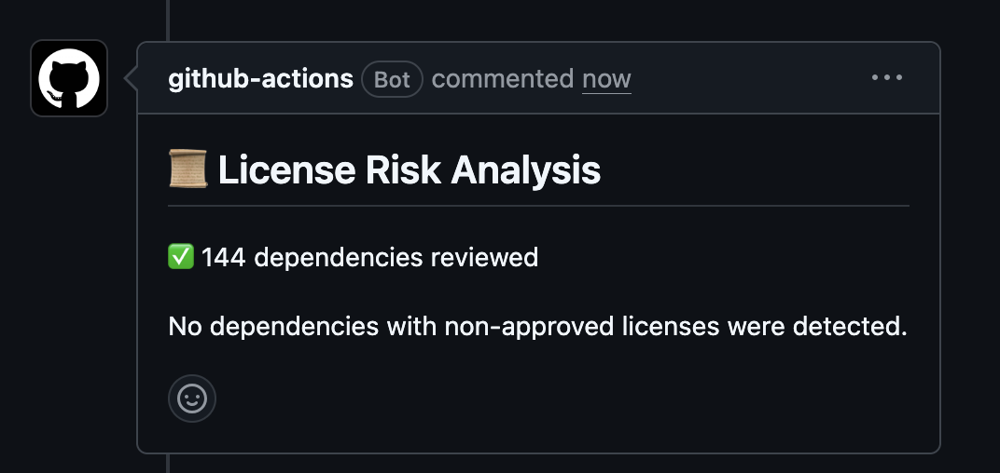

# MiteLovers

A second-hand book and magazine marketplace built with Java and Spring Boot, developed as part of the SwitchDev LABPROJ 25/26 programme.

---

## Prerequisites

- Java 21
- Maven 3.8+

---

## Table of contents

<!-- TOC -->
* [MiteLovers](#mitelovers)
  * [Prerequisites](#prerequisites)
  * [Table of contents](#table-of-contents)
  * [Build, Test and Run](#build-test-and-run)
  * [DevSecOps Workflow](#devsecops-workflow)
    * [Branching Strategy](#branching-strategy)
    * [Branch Protection Rules](#branch-protection-rules)
    * [Development Flow](#development-flow)
    * [Quality Gates](#quality-gates)
    * [Security Findings Severity Reporting](#security-findings-severity-reporting)
  * [Test Coverage](#test-coverage)
  * [OWASP Security Tests](#owasp-security-tests)
    * [Accepted-Risk Documentation Pattern](#accepted-risk-documentation-pattern)
    * [Test Classes](#test-classes)
    * [Running the Security Tests](#running-the-security-tests)
  * [CI Pipeline](#ci-pipeline)
    * [Notify Discord on PR Creation](#notify-discord-on-pr-creation)
    * [Notify Discord on PR Merge](#notify-discord-on-pr-merge)
    * [Hardened Security Pipeline](#hardened-security-pipeline)
    * [Secret Detection with `Gitleaks`](#secret-detection-with-gitleaks)
    * [Static Code Analysis and Security Checks with Semgrep](#static-code-analysis-and-security-checks-with-semgrep)
    * [Insecure Configuration Detection (config-scan)](#insecure-configuration-detection-config-scan)
    * [Run Tests on Pull Request](#run-tests-on-pull-request)
    * [Dependency Inventory (SBOM) and Scanning (SCA - OWASP Dependency-Check)](#dependency-inventory-sbom-and-scanning-sca---owasp-dependency-check)
    * [License Risk Management](#license-risk-management)
      * [License Policy](#license-policy)
  * [SpringBoot application.properties](#springboot-applicationproperties)
    * [Development-only settings (`dev` profile)](#development-only-settings-dev-profile)
  * [Quality & Security Gates (Authoritative Section)](#quality--security-gates-authoritative-section)
    * [Purpose of the Gates](#purpose-of-the-gates)
    * [Blocking Behaviour](#blocking-behaviour)
    * [Quality Gates](#quality-gates-1)
    * [Security Gates](#security-gates)
    * [Quality & Security Gates Summary Table](#quality--security-gates-summary-table)
  * [Local Security & Quality Testing (Developer Guide)](#local-security--quality-testing-developer-guide)
    * [How to fix Failing Gates](#how-to-fix-failing-gates)
      * [Coverage < 95%](#coverage--95)
      * [Semgrep ERROR finding](#semgrep-error-finding)
      * [Gitleaks secret detected](#gitleaks-secret-detected)
      * [Dependency‑Check CVSS ≥ 7](#dependencycheck-cvss--7)
      * [SBOM or build failure](#sbom-or-build-failure)
  * [Docker](#docker)
    * [Prerequisites](#prerequisites-1)
    * [Backend](#backend)
    * [Frontend](#frontend)
    * [Image Security](#image-security)
  * [Container Orchestration with Docker Compose](#container-orchestration-with-docker-compose)
      * [Application service and image build](#application-service-and-image-build)
      * [Least-privilege configuration: ports, volumes, environment](#least-privilege-configuration-ports-volumes-environment)
      * [Runtime security hardening](#runtime-security-hardening)
      * [Health check](#health-check)
      * [Running it](#running-it)
      * [Validation](#validation)
<!-- TOC -->
___


## Build, Test and Run

To compile, build and run all tests of the application:

```bash
mvn clean verify
```

To run tests only:

```bash
mvn clean test
```

To run the application locally, there are two options.

**Option 1:**

macOs/Linux:
```bash
mvn spring-boot:run -Dspring-boot.run.profiles=mem
```

Windows:
```
mvn spring-boot:run "-Dspring-boot.run.profiles=mem"
```

- starts the app using an in-memory profile, meaning the database lives only in RAM and is wiped clean every time the app stops (Assuming tha the JDBC URL in `application.properties` is set to `jdbc:h2:mem:miteloversdb`).

**Option 2:**

macOs/Linux:
```bash
mvn spring-boot:run -Dspring-boot.run.profiles=jpa,bootstrap
```

Windows:
```
mvn spring-boot:run "-Dspring-boot.run.profiles=jpa,bootstrap"
```

- starts the app with two profiles: jpa for file/persistent database configuration, and bootstrap to seed initial data on startup. Data survives restarts.

The application will start on `http://localhost:8081`.

The H2 console is available at `http://localhost:8081/h2-console` with the following settings:
- JDBC URL: `jdbc:h2:file:./data/miteloversdb`
- Username: `sa`
- Password: *(leave blank)*

---

## DevSecOps Workflow

### Branching Strategy
- `b3` and `b4` are the main integration branches;
- Feature branches are created from `b3` or `b4` depending on the work assigned to each team member;
- All changes are integrated via Pull Requests;
- Direct pushes to `b3` and `b4` are reserved for exceptional cases;
- Direct pushes to `main` are not allowed.

### Branch Protection Rules

Branch protection is enforced at repository level through GitHub Rulesets managed by the repository administrators.

The development team does not have administrative permissions to view or modify the configured rulesets. Therefore, the exact configuration could not be independently verified by team members.

The project's workflow was designed around the use of integration branches (`main`, `b3`, and `b4`), with all contributions being submitted through Pull Requests and validated by the CI/CD pipeline before merge.

Administrative management of branch protection policies is the responsibility of the repository administrators and teaching staff.


### Development Flow
1. Create a feature branch from `b3` or `b4`;
2. Develop and commit following the convention: `[feat|fix|refactor|docs|config]: description closes #issue`;
3. Open a Pull Request targeting `b3` or `b4`;
4. CI pipeline runs automatically — all checks must pass;
5. Code is reviewed and merged.

### Quality Gates
- All tests must pass;
- Build must succeed with `mvn clean verify`.
- JaCoCo line coverage must be ≥ 95%;

### Security Findings Severity Reporting

Every Pull Request automatically receives comments summarising security findings from each tool:

| Tool                   | Severity Levels                    | Blocking Threshold  |
|------------------------|------------------------------------|---------------------|
| Gitleaks               | N/A (binary: secret found or not)  | Any secret detected |
| Semgrep                | ERROR, WARNING, INFO               | ERROR               |
| OWASP Dependency-Check | CRITICAL, HIGH, MEDIUM, LOW (CVSS) | CVSS ≥ 7 (HIGH)     |

- **Gitleaks** posts a comment listing every detected secret (rule, file, line) if any are found.
- **Semgrep** posts a breakdown of findings grouped by severity (ERROR / WARNING / INFO).
- **OWASP Dependency-Check** posts a table of vulnerable dependencies with CVE ID, CVSS score, and severity level.

Findings above the defined threshold cause the pipeline to fail and block the PR from merging.

---

## Test Coverage

It was decided to link the coverage threshold to the `mvn verify` stage, with JaCoCo configured to enforce a minimum line coverage of **95%**.

For that we updated the JaCoCo plugin in the pom.xml:

```xml
<plugins>
    <!-- JaCoCo (coverage) -->
    <plugin>
        <groupId>org.jacoco</groupId>
        <artifactId>jacoco-maven-plugin</artifactId>
        <version>${jacoco.version}</version>
        <executions>
            <execution>
                <goals>
                    <goal>prepare-agent</goal>
                </goals>
            </execution>
            <execution>
                <id>report</id>
                <goals>
                    <goal>report</goal>
                </goals>
            </execution>
            <!-- Verifies that coverage is higher than 95% -->
            <execution>
                <id>check-coverage</id>
                <phase>verify</phase>
                <goals><goal>check</goal></goals>
                <configuration>
                    <rules>
                        <rule>
                            <element>BUNDLE</element>
                            <limits>
                                <limit>
                                    <counter>LINE</counter>
                                    <value>COVEREDRATIO</value>
                                    <minimum>0.95</minimum>
                                </limit>
                            </limits>
                        </rule>
                    </rules>
                </configuration>
            </execution>
        </executions>
    </plugin>
</plugins>
```

This sets several goals:

- `<phase>verify</phase>` binds this execution to the `verify` phase, so it runs and enforces the coverage whenever `mvn verify` is run;
- `<goal>check</goal>` tells JaCoCo to check coverage against the rules;
- `<counter>LINE</counter>` measures line coverage;
- `<value>COVEREDRATIO</value>` uses ratio (0.0 to 1.0);
- `<minimum>0.95</minimum>` enforces 95% minimum, failing the build if coverage drops below that.

The build will fail automatically if coverage drops below this threshold, blocking any non-compliant code from being integrated.

To generate the coverage report locally:

```bash
mvn clean verify
```

The HTML report is available at `target/site/jacoco/index.html`.

___

## OWASP Security Tests

The project maintains a dedicated security test suite under `src/test/java/MITELOVERS/security/`, covering all ten categories of the OWASP Top 10 across the 2021 and 2025 editions. These tests do **not** verify that the application is secure — they document known vulnerabilities and formally record accepted risks as executable specifications.

### Accepted-Risk Documentation Pattern

Each test is designed to **pass precisely because the vulnerability it describes is present**. This creates a traceable, version-controlled record of acknowledged risk: if the underlying issue is resolved (e.g. authentication is added, inputs are validated, or cryptographic configuration is hardened), the corresponding test will fail, prompting the team to either update the test to reflect the new security posture or confirm that the fix was intentional.

All test classes carry Javadoc headers that explain:

- what the vulnerability is and how it manifests in the current code;
- why the test is expected to pass (the risk is acknowledged, not fixed);
- what remediation would look like, and why it is out of scope for the current sprint.

### Test Classes

| Class | OWASP Category | Test Mechanism | What It Documents |
|---|---|---|---|
| `ListOfItemsOWASPSecurityTest` | A01:2021 Broken Access Control | `@WebMvcTest` + MockMvc | List endpoints accept mutating requests without ownership verification (IDOR) |
| `UserEnumerationSecurityTest` | A04:2021 Insecure Design | `@WebMvcTest` + MockMvc | Email existence is inferrable from distinct error responses, enabling account enumeration |
| `InsecureConfigurationSecurityTest` | A05:2021 Security Misconfiguration | Plain JUnit + properties file | H2 console enabled in dev profile without auth; no Spring Security configured in any profile |
| `SupplyChainSecurityTest` | A03:2025 Supply Chain Failures | Plain JUnit + `package.json` | Frontend dependencies use unpinned `^` version ranges with no lockfile shrinkwrap |
| `CryptographicFailuresSecurityTest` | A04:2025 Cryptographic Failures | Plain JUnit + properties file | Empty datasource password; no TLS keystore configured in any profile |
| `InjectionSecurityTest` | A05:2025 Injection | `@WebMvcTest` + MockMvc | SQL-like and special-character payloads reach the service layer unsanitised |
| `AuthenticationFailuresSecurityTest` | A07:2025 Authentication Failures | `@WebMvcTest` + MockMvc | Fabricated `X-User-Id` headers are accepted; absent header is not rejected |
| `DataIntegritySecurityTest` | A08:2025 Data Integrity Failures | `@WebMvcTest` + MockMvc | Mutating requests succeed on replay; `X-Content-Type-Options` header is absent |
| `SecurityLoggingSecurityTest` | A09:2025 Logging & Alerting Failures | Plain JUnit + Logback context | No dedicated security log level or audit logger is configured |
| `ExceptionHandlingSecurityTest` | A10:2025 Mishandling of Exceptions | `@WebMvcTest` + MockMvc | Internal domain exception messages (aggregate IDs, class names) propagated verbatim in HTTP responses |

### Running the Security Tests

All security test classes are annotated with `@Tag("security")` and participate in the standard Maven test phase. No running application or database connection is required: `@WebMvcTest` tests use mocked service beans, and plain JUnit tests read configuration files directly from `src/main/resources/`.

Run the full test suite (includes security tests):

```bash
mvn test
```

Run only the security tests:

```bash
mvn test -Dtest="*SecurityTest"
```

___

## CI Pipeline

The project uses GitHub Actions for continuous integration.

The pipeline triggers automatically on:
- Every pull request targeting `main`, `b3`, or `b4`

For that, we defined three different GitHub worflows:
  - Notify Discord on PR Creation
  - Notify Discord on PR Merge
  - Hardened Security Pipeline

___

### Notify Discord on PR Creation

This workflow sends an automated message triggered by any pull request to the teams Discord channel. 

The objective is to notify the existence of a new PR, so that the team can assingn reviewers to it:

```yaml
name: Notify Discord on PR Creation

on:
  pull_request:
    types: [opened, reopened]

jobs:
  notify:
    runs-on: ubuntu-latest

    steps:
      - name: Send message to Discord
        run: |
          curl -H "Content-Type: application/json" \
          -d "$(jq -n \
            --arg title "${{ github.event.pull_request.title }}" \
            --arg user "${{ github.event.pull_request.user.login }}" \
            --arg url "${{ github.event.pull_request.html_url }}" \
            --arg number "${{ github.event.pull_request.number }}" \
            --arg base "${{ github.event.pull_request.base.ref }}" \
            '{
              content: (
                "📢 New Pull Request #" + $number + "to merge into " + $base + "\n" +
                "🏷️ " + $title + "\n" +
                "👤 " + $user + "\n" +
                "🌐 " + $url
              )
            }')" \
          ${{ secrets.DISCORD_INCOMING_PR_WEBHOOK }}
```

---

### Notify Discord on PR Merge

This GitHub workflow presents a complementary action to the first one.

It is triggered whenever a Pull Request is merged on a certain branch and notifies the team to integrate these new changes in their local working branches:

```yaml
name: Notify Discord on PR Merge

on:
  pull_request:
    types: [closed]

jobs:
  notify:
    if: github.event.pull_request.merged == true
    runs-on: ubuntu-latest


    steps:
      - name: Send message to Discord
        run: |
          curl -H "Content-Type: application/json" \
          -d "$(jq -n \
            --arg title "${{ github.event.pull_request.title }}" \
            --arg user "${{ github.event.pull_request.user.login }}" \
            --arg url "${{ github.event.pull_request.html_url }}" \
            --arg number "${{ github.event.pull_request.number }}" \
            --arg base "${{ github.event.pull_request.base.ref }}" \
            '{
              content: (
                "🚀 PR #" + $number + " merged to " + $base + "\n" +
                "🏷️ " + $title + "\n" +
                "👤 " + $user + "\n" +
                "🌐 " + $url + "\n\n" +
                "🚨 Please update your branches!"
              )
            }')" \
          ${{ secrets.DISCORD_WEBHOOK }}
```
---
### Hardened Security Pipeline

This workflow, comprised of several jobs, seeks to enforce a propper running order for several tasks.

It consists of the following jobs:
- `gitleaks`: secret detection, with a PR comment listing any findings;
- `semgrep-sast`: SAST scan, with findings grouped by severity in a PR comment;
- `config-scan`: insecure-configuration detection on Spring property files;
- `build-and-test-with-coverage`: build + tests + JaCoCo coverage + OWASP Dependency-Check (SCA) + SBOM, with a PR comment per report.


The full pipeline is configured as follows:
```yaml
name: Hardened Security Pipeline

on:
  pull_request:
    branches:
      - main
      - b3
      - b4

env:
  FORCE_JAVASCRIPT_ACTIONS_TO_NODE24: true

jobs:
  gitleaks:
    runs-on: ubuntu-latest

    permissions:
      contents: read
      pull-requests: write

    steps:
      - name: Checkout full history
        uses: actions/checkout@v4
        with:
          fetch-depth: 0

      - name: Install Gitleaks
        run: |
          wget https://github.com/gitleaks/gitleaks/releases/download/v8.27.2/gitleaks_8.27.2_linux_x64.tar.gz
          tar -xzf gitleaks_8.27.2_linux_x64.tar.gz
          sudo mv gitleaks /usr/local/bin/
          gitleaks version

      - name: Run Gitleaks
        id: gitleaks
        continue-on-error: true
        run: |
          gitleaks detect \
            --source . \
            --report-format json \
            --report-path gitleaks-report.json \
            --exit-code 1

      - name: Post Gitleaks comment on PR
        if: steps.gitleaks.outcome == 'failure'
        uses: actions/github-script@v7
        with:
          script: |
            const fs = require('fs');
            let body = '## Gitleaks – Secret Detection Failed\n\n';

            try {
              const report = JSON.parse(fs.readFileSync('gitleaks-report.json', 'utf8'));

              if (report.length === 0) {
                body += 'No secrets found.';
              } else {
                body += `**${report.length} secret(s) detected:**\n\n`;
                body += '| Rule | File | Line |\n|---|---|---|\n';

                for (const finding of report) {
                  body += `| \`${finding.RuleID}\` | \`${finding.File}\` | ${finding.StartLine} |\n`;
                }

                body += '\n> ⚠️ Remove the secret, rotate the credential, and purge it from Git history.';
              }
            } catch (e) {
              body += '_Could not parse Gitleaks report._';
            }

            await github.rest.issues.createComment({
              owner: context.repo.owner,
              repo: context.repo.repo,
              issue_number: context.issue.number,
              body
            });

      - name: Upload Gitleaks report
        if: always()
        uses: actions/upload-artifact@v4
        with:
          name: gitleaks-report
          path: gitleaks-report.json

      - name: Fail if Gitleaks found leaks
        if: steps.gitleaks.outcome == 'failure'
        run: exit 1

  semgrep-sast:
    name: Semgrep SAST
    runs-on: ubuntu-latest
    needs: gitleaks

    container:
      image: semgrep/semgrep

    permissions:
      contents: read
      issues: write
      pull-requests: write
      security-events: write

    steps:
      - name: Checkout repository
        uses: actions/checkout@v4

      - name: Run Semgrep scan JSON report
        run: |
          TARGETS="src .github pom.xml"

          if [ -d "frontend" ]; then
            TARGETS="$TARGETS frontend"
          fi

          semgrep scan \
            --config=auto \
            --json \
            --output=semgrep-report.json \
            $TARGETS || true
          [ -f semgrep-report.json ] || echo '{"results":[]}' > semgrep-report.json

      - name: Show Semgrep findings
        if: always()
        run: |
          if [ -f semgrep-report.json ]; then
            jq -r '.results[] | "\(.path):\(.start.line) [\(.check_id)] \(.extra.severity) - \(.extra.message)"' semgrep-report.json
          else
            echo "semgrep-report.json not found"
          fi

      - name: Upload Semgrep JSON report
        if: always()
        uses: actions/upload-artifact@v4.6.2
        with:
          name: semgrep-sast-report
          path: semgrep-report.json

      - name: Post Semgrep comment on PR
        if: always()
        uses: actions/github-script@v7
        with:
          script: |
            const fs = require('fs');
            let body = '## 🔍 Semgrep SAST – Findings Summary\n\n';
            try {
              const report = JSON.parse(fs.readFileSync('semgrep-report.json', 'utf8'));
              const results = report.results || [];
              if (results.length === 0) {
                body += '✅ No findings detected.';
              } else {
                const bySeverity = { ERROR: [], WARNING: [], INFO: [] };
                for (const r of results) {
                  const sev = r.extra?.severity?.toUpperCase() || 'INFO';
                  if (bySeverity[sev]) bySeverity[sev].push(r);
                }
                for (const [sev, items] of Object.entries(bySeverity)) {
                  if (items.length === 0) continue;
                  const emoji = sev === 'ERROR' ? '🔴' : sev === 'WARNING' ? '🟡' : '🔵';
                  body += `### ${emoji} ${sev} (${items.length})\n\n`;
                  body += '| Rule | File | Line | Message |\n|---|---|---|---|\n';
                  for (const item of items) {
                    const file = item.path || '';
                    const line = item.start?.line || '';
                    const rule = item.check_id || '';
                    const msg = (item.extra?.message || '').substring(0, 80);
                    body += `| \`${rule}\` | \`${file}\` | ${line} | ${msg} |\n`;
                  }
                }
              }
            } catch (e) {
              body += '_Could not parse Semgrep report._';
            }
            await github.rest.issues.createComment({
              owner: context.repo.owner,
              repo: context.repo.repo,
              issue_number: context.issue.number,
              body
            });

      - name: Enforce Semgrep gate (fail on ERROR)
        if: always()
        run: |
          ERRORS=$(jq '[.results[] | select(.extra.severity=="ERROR")] | length' semgrep-report.json)
          echo "Semgrep ERROR findings: $ERRORS"
          if [ "$ERRORS" -gt 0 ]; then
            echo "::error::Semgrep found $ERRORS ERROR-severity finding(s)."
            exit 1
          fi

  config-scan:
    name: Insecure Config Scan (Semgrep)
    runs-on: ubuntu-latest

    permissions:
      contents: read

    steps:
      - name: Checkout repository
        uses: actions/checkout@v4

      - name: Install Semgrep
        run: pip install semgrep

      - name: Run Semgrep config rules
        run: |
          semgrep scan \
            --config .github/semgrep/spring-misconfig.yml \
            --json --output config-scan-report.json \
            --error \
            src/

      - name: Upload config scan report
        if: always()
        uses: actions/upload-artifact@v4.6.2
        with:
          name: config-scan-report
          path: config-scan-report.json

  build-and-test-with-coverage:
    runs-on: ubuntu-latest
    needs: [semgrep-sast, config-scan]

    permissions:
      contents: read
      pull-requests: write

    env:
      NVD_API_KEY: ${{ secrets.NVD_API_KEY }}

    steps:
      - name: Checkout code
        uses: actions/checkout@v4.2.2

      - name: Set up JDK 21
        uses: actions/setup-java@v4.7.0
        with:
          distribution: temurin
          java-version: '21'
          cache: maven

        - name: Setup Node.js
        uses: actions/setup-node@v4
        with:
          node-version: 20

      - name: Install frontend dependencies (deterministic)
        working-directory: frontend
        run: npm ci

      - name: Run frontend tests
        working-directory: frontend
        run: npm test -- --run

      - name: Verify frontend coverage
        working-directory: frontend
        run: npm run test:coverage

      - name: Build frontend
        working-directory: frontend
        run: npm run build
        
      - name: Cache OWASP Dependency-Check data
        uses: actions/cache@v4
        with:
          path: ~/.m2/repository/org/owasp/dependency-check-data
          key: dependency-check-${{ runner.os }}-${{ hashFiles('**/pom.xml') }}
          restore-keys: |
            dependency-check-${{ runner.os }}

      - name: Build test and run security scans
        run: mvn clean verify

      - name: Upload Dependency-Check JSON
        if: always()
        uses: actions/upload-artifact@v4.6.2
        with:
          name: dependency-check-json
          path: target/dependency-check-report.json

      - name: Post Dependency-Check comment on PR
        if: always()
        uses: actions/github-script@v7
        with:
          script: |
            const fs = require('fs');
            let body = '## OWASP Dependency-Check – SCA Findings\n\n';
            try {
              const report = JSON.parse(fs.readFileSync('target/dependency-check-report.json', 'utf8'));
              const rows = [];
              for (const dep of report.dependencies || []) {
                if (!dep.vulnerabilities) continue;
                for (const v of dep.vulnerabilities) {
                  // CVSS: tenta v3 primeiro, depois v2
                  let score = v.cvssv3?.baseScore ?? v.cvssv2?.score ?? null;
                  let sev = (v.severity || '').toUpperCase();
                  rows.push({
                    dep: dep.fileName || '',
                    cve: v.name || '',
                    score: score !== null ? Number(score) : -1,
                    sev
                  });
                }
              }

              if (rows.length === 0) {
                body += '✅ No known vulnerabilities found.';
              } else {
                // ordena por CVSS desc
                rows.sort((a, b) => b.score - a.score);
                const order = { CRITICAL: 4, HIGH: 3, MEDIUM: 2, LOW: 1 };
                const counts = { CRITICAL: 0, HIGH: 0, MEDIUM: 0, LOW: 0 };
                for (const r of rows) if (counts[r.sev] !== undefined) counts[r.sev]++;

                body += `**${rows.length} vulnerable finding(s):** `;
                body += `🔴 ${counts.CRITICAL} Critical · 🟠 ${counts.HIGH} High · `;
                body += `🟡 ${counts.MEDIUM} Medium · 🔵 ${counts.LOW} Low\n\n`;
                body += '| Dependency | CVE | CVSS | Severity |\n|---|---|---|---|\n';
                for (const r of rows.slice(0, 30)) {
                  const score = r.score >= 0 ? r.score.toFixed(1) : 'N/A';
                  body += `| \`${r.dep}\` | ${r.cve} | ${score} | ${r.sev} |\n`;
                }
                if (rows.length > 30) body += `\n_…and ${rows.length - 30} more (see full report artifact)._\n`;
                body += '\n> ⚠️ Build fails on any vulnerability with CVSS ≥ 7.';
              }
            } catch (e) {
              body += '_Could not read Dependency-Check JSON report._';
            }
            await github.rest.issues.createComment({
              owner: context.repo.owner,
              repo: context.repo.repo,
              issue_number: context.issue.number,
              body
            });

      - name: Upload application artifact
        if: success()
        uses: actions/upload-artifact@v4.6.2
        with:
          name: mitelovers-${{ github.run_number }}
          path: target/*.jar

      - name: Upload JaCoCo coverage report
        if: always()
        uses: actions/upload-artifact@v4.6.2
        with:
          name: jacoco-report
          path: target/site/jacoco/

      - name: Upload Dependency-Check report
        if: always()
        uses: actions/upload-artifact@v4.6.2
        with:
          name: dependency-check-report
          path: target/dependency-check-report.html

      - name: Upload SBOM
        if: always()
        uses: actions/upload-artifact@v4.6.2
        with:
          name: sbom-cyclonedx
          path: target/bom.xml

      - name: Post coverage comment
        if: always()
        uses: madrapps/jacoco-report@v1.7.1
        with:
          paths: ${{ github.workspace }}/target/site/jacoco/jacoco.xml
          token: ${{ secrets.GITHUB_TOKEN }}
          min-coverage-overall: 0
          min-coverage-changed-files: 0
```

Besides the steps already covered, we created an environment variable `FORCE_JAVASCRIPT_ACTIONS_TO_NODE24`, that forces all JavaScript-based actions (checkout, setup-java, upload-artifact) to run on Node.js 24 instead of the deprecated Node.js 20, removing the deprecation warning.

---

### Secret Detection with `Gitleaks`

To improve the security of the development workflow, a dedicated job was added to the Hardened Security Pipeline workflow, to detect accidentally committed secrets.

It is automatically triggered on every Pull Request targeting:

```yaml
main
b3
b4
```

The job performs the following steps:

1. Checks out the complete repository history (`fetch-depth: 0`);
2. Installs Gitleaks on the GitHub runner;
3. Scans the repository for secrets and sensitive information;
4. Generates a JSON report containing all findings;
5. Uploads the report as a GitHub Actions artifact.

Job definition:

```yaml
  gitleaks:
    runs-on: ubuntu-latest

    steps:
      - name: Checkout full history
        uses: actions/checkout@v4
        with:
          fetch-depth: 0

      - name: Install Gitleaks
        run: |
          wget https://github.com/gitleaks/gitleaks/releases/download/v8.27.2/gitleaks_8.27.2_linux_x64.tar.gz
          tar -xzf gitleaks_8.27.2_linux_x64.tar.gz
          sudo mv gitleaks /usr/local/bin/

      - name: Run Gitleaks
        run: |
          gitleaks detect \
            --source . \
            --report-format json \
            --report-path gitleaks-report.json \
            --exit-code 1

      - name: Upload Gitleaks report
        if: always()
        uses: actions/upload-artifact@v4
        with:
          name: gitleaks-report
          path: gitleaks-report.json
```

The option `--exit-code 1` ensures that the job fails whenever a secret is detected, preventing insecure code from being merged.

Examples of information that Gitleaks can detect include:

- API keys;
- Access tokens;
- Passwords;
- Private keys;
- Cloud provider credentials;
- Hardcoded secrets.

A validation test was performed by introducing a fake secret into a temporary file.
Gitleaks correctly detected the secret and failed the pipeline. Even after the file was deleted, the pipeline continued to fail because the secret remained in the Git history. This confirmed that Gitleaks scans the full commit history (`fetch-depth: 0`) and not only the current contents of the repository.

---


### Static Code Analysis and Security Checks with Semgrep

Semgrep was integrated into the CI pipeline as a static application security testing (SAST) stage to automatically detect insecure code patterns and bad practices in the Java codebase, on every pull request targeting `main`, `b3`, or `b4`.

The job runs after the secret-detection (`gitleaks`) job, using the official Semgrep container to scan `src/`, `.github/`, and `pom.xml` with the `--config=auto` ruleset, which applies a curated set of language-aware security and correctness rules (e.g. SQL injection, weak cipher usage, hardcoded credentials).

> Insecure **configuration** detection is handled by the separate `config-scan` job, not by this SAST scan.

```yaml
   semgrep-sast:
     name: Semgrep SAST
     runs-on: ubuntu-latest
     needs: gitleaks

     container:
       image: semgrep/semgrep

     permissions:
       contents: read
       issues: write
       pull-requests: write
       security-events: write

     steps:
       - name: Checkout repository
         uses: actions/checkout@v4

       - name: Run Semgrep scan JSON report
         run: |
           TARGETS="src .github pom.xml"

           if [ -d "frontend" ]; then
             TARGETS="$TARGETS frontend"
           fi

           semgrep scan \
             --config=auto \
             --json \
             --output=semgrep-report.json \
             $TARGETS || true
           [ -f semgrep-report.json ] || echo '{"results":[]}' > semgrep-report.json

       - name: Show Semgrep findings
         if: always()
         run: |
           if [ -f semgrep-report.json ]; then
             jq -r '.results[] | "\(.path):\(.start.line) [\(.check_id)] \(.extra.severity) - \(.extra.message)"' semgrep-report.json
           else
             echo "semgrep-report.json not found"
           fi

       - name: Upload Semgrep JSON report
         if: always()
         uses: actions/upload-artifact@v4.6.2
         with:
           name: semgrep-sast-report
           path: semgrep-report.json

       - name: Post Semgrep comment on PR
         if: always()
         uses: actions/github-script@v7
         with:
           script: |
             const fs = require('fs');
             let body = '## 🔍 Semgrep SAST – Findings Summary\n\n';
             try {
               const report = JSON.parse(fs.readFileSync('semgrep-report.json', 'utf8'));
               const results = report.results || [];
               if (results.length === 0) {
                 body += '✅ No findings detected.';
               } else {
                 const bySeverity = { ERROR: [], WARNING: [], INFO: [] };
                 for (const r of results) {
                   const sev = r.extra?.severity?.toUpperCase() || 'INFO';
                   if (bySeverity[sev]) bySeverity[sev].push(r);
                 }
                 for (const [sev, items] of Object.entries(bySeverity)) {
                   if (items.length === 0) continue;
                   const emoji = sev === 'ERROR' ? '🔴' : sev === 'WARNING' ? '🟡' : '🔵';
                   body += `### ${emoji} ${sev} (${items.length})\n\n`;
                   body += '| Rule | File | Line | Message |\n|---|---|---|---|\n';
                   for (const item of items) {
                     const file = item.path || '';
                     const line = item.start?.line || '';
                     const rule = item.check_id || '';
                     const msg = (item.extra?.message || '').substring(0, 80);
                     body += `| \`${rule}\` | \`${file}\` | ${line} | ${msg} |\n`;
                   }
                 }
               }
             } catch (e) {
               body += '_Could not parse Semgrep report._';
             }
             await github.rest.issues.createComment({
               owner: context.repo.owner,
               repo: context.repo.repo,
               issue_number: context.issue.number,
               body
             });

       - name: Enforce Semgrep gate (fail on ERROR)
         if: always()
         run: |
           ERRORS=$(jq '[.results[] | select(.extra.severity=="ERROR")] | length' semgrep-report.json)
           echo "Semgrep ERROR findings: $ERRORS"
           if [ "$ERRORS" -gt 0 ]; then
             echo "::error::Semgrep found $ERRORS ERROR-severity finding(s)."
             exit 1
           fi

```
The scan captures findings at all severity levels (ERROR, WARNING, INFO) and posts a PR comment grouping them by severity. A dedicated gate step (`Enforce Semgrep gate`) then fails the job only when ERROR-severity findings are present; WARNING and INFO findings are reported but do not block the merge.

Additionally, the job produces a JSON report (`semgrep-report.json`) that is uploaded as a pipeline artifact, which allows inspection of the detailed results for each run.

By chaining Semgrep after Gitleaks and before the build-and-test stage, the pipeline ensures that obvious secret leaks, insecure coding patterns, and high‑severity vulnerabilities are caught early, making security an integral part of the DevSecOps workflow rather than a late, manual step.

The job's validation was tested with the temporary addition of a file containing SQL injection, which caused the PR to fail during Semgrep scan:


---

### Insecure Configuration Detection (config-scan)

Code-level analysis is covered by the `semgrep-sast` job; this `config-scan` job is its configuration-level counterpart, focused on insecure settings rather than insecure code.


Beyond code-level SAST, a dedicated `config-scan` job detects insecure settings in Spring property files using a custom Semgrep ruleset located at`.github/semgrep/spring-misconfig.yml`. It flags misconfigurations such as an enabled H2 console, fully exposed Actuator endpoints, stack traces returned to clients, and disabled TLS.

Each rule has a severity (ERROR / WARNING / INFO). The job runs with --error, so the pipeline fails on any finding, in practice, the rules that flag the shared configuration are ERROR-severity.

Development-only settings (e.g. the H2 console and SQL logging) were moved out of the shared `application.properties` into a dedicated `application-dev.properties`, loaded only under the `dev` profile and never active in CI or production. The Semgrep ruleset excludes `application-dev.properties` from the scan, since these settings are legitimate in a local development context while the shared configuration stays clean and fully scanned.

```yaml
  config-scan:
    name: Insecure Config Scan (Semgrep)
    runs-on: ubuntu-latest
    needs: gitleaks

    permissions:
      contents: read

    steps:
      - name: Checkout repository
        uses: actions/checkout@v4

      - name: Install Semgrep
        run: pip install semgrep

      - name: Run Semgrep config rules
        run: |
          semgrep scan \
            --config .github/semgrep/spring-misconfig.yml \
            --json --output config-scan-report.json \
            --error \
            src/

      - name: Upload config scan report
        if: always()
        uses: actions/upload-artifact@v4.6.2
        with:
          name: config-scan-report
          path: config-scan-report.json
```
The `config-scan` job runs in parallel with `semgrep-sast`, both gated behind the `gitleaks` job: secret detection runs first, and only if it passes do the two Semgrep-based scans run. Keeping configuration scanning as a separate job (with its own report and PR check) makes it immediately clear whether a failure came from insecure *code* (`semgrep-sast`) or insecure *configuration* (`config-scan`).

Unlike the SAST job, this job does not use the Semgrep container: since the ruleset is a local file in the repository, Semgrep is installed directly on the runner (`pip install semgrep`) so the `--config` path resolves against the checked-out workspace.

---

### Run Tests on Pull Request

On each Pull Request trigger, the `build-and-test-with-coverage` job runs `mvn clean verify` which:

- Compiles the code
- Executes all tests
- Enforces a 95% test line coverage threshold via JaCoCo
- Runs OWASP Dependency-Check to scan for vulnerabilities (fails build if CVSS ≥ 7)
- Generates a CycloneDX SBOM (Software Bill of Materials)

Following good DevOps practices, the pipeline archives multiple security and quality reports as downloadable artifacts: 

- JaCoCo coverage report (HTML format)
- OWASP Dependency-Check vulnerability report (HTML format)
- CycloneDX SBOM (XML format, machine-readable)

To finish, another step was established, to post a coverage comment on the Pull Request itself, with invaluable data such as the line coverage per code class and the impact the worked-on classes had on the overall project's line coverage. A community made `madrapps/jacoco-report` action was used for this purpose:


The `build-and-test-with-coverage` job is configured as follows:

```yaml
  build-and-test-with-coverage:
    runs-on: ubuntu-latest
    needs: [semgrep-sast, config-scan]

    permissions:
      contents: read
      pull-requests: write

    env:
      NVD_API_KEY: ${{ secrets.NVD_API_KEY }}

    steps:
      - name: Checkout code
        uses: actions/checkout@v4.2.2
      - name: Set up JDK 21
        uses: actions/setup-java@v4.7.0
        with:
          distribution: temurin
          java-version: '21'
          cache: maven
      - name: Build, test, and run security scans
        run: mvn clean verify
      - name: Upload JaCoCo coverage report
        if: always()
        uses: actions/upload-artifact@v4.6.2
        with:
          name: jacoco-report
          path: target/site/jacoco/
      - name: Upload Dependency-Check report
        if: always()
        uses: actions/upload-artifact@v4.6.2
        with:
          name: dependency-check-report
          path: target/dependency-check-report.html
      - name: Upload SBOM
        if: always()
        uses: actions/upload-artifact@v4.6.2
        with:
          name: sbom-cyclonedx
          path: target/bom.xml
      - name: Post coverage comment
        if: always()
        uses: madrapps/jacoco-report@v1.7.1
        with:
          paths: ${{ github.workspace }}/target/site/jacoco/jacoco.xml
          token: ${{ secrets.GITHUB_TOKEN }}
          min-coverage-overall: 0
          min-coverage-changed-files: 0
```

Additionally, a permissions block was added:

- `contents`: read — allows the workflow to clone/read the repository contents;
- `pull-requests`: write — allows the workflow to post comments on the PR (needed for the JaCoCo coverage comment).

---

### Dependency Inventory (SBOM) and Scanning (SCA - OWASP Dependency-Check)

As part of hardening the security pipeline, **Software Composition Analysis (SCA)** was integrated into the above referenced `build-and-test-with-coverage` job via the **OWASP Dependency-Check** Maven plugin, which analyzes third-party dependencies declared in our `pom.xml` against public vulnerability databases (like the **National Vulnerability Database**, or NVD). A build will fail if a vulnerability with **CVSS** (Common Vulnerability Scoring System) ≥ **7** is detected, preventing a Pull Request from being merged if it introduces a dependency containing a known high-severity issue. Remediation of the known vulnerability is necessary for the pipeline to pass.

A **Software Bill of Materials (SBOM)** is also generated through the **CycloneDX** plugin, creating a _machine-readable_ inventory of all third-party components in the application (101 in total). The SBOM artifact provides traceability for supply-chain risk. If and when a new vulnerability is publicly announced, the team can quickly check if the affected library exists in the SBOM, enabling rapid impact assessment and remediation without the need to rescan or manually inspect all application dependencies again.

**OWASP Dependency-Check plugin configuration** (pom.xml):

```
<!-- OWASP Dependency-Check (SCA) -->
<plugin>
    <groupId>org.owasp</groupId>
    <artifactId>dependency-check-maven</artifactId>
    <version>12.2.2</version>
    <configuration>
        <failBuildOnCVSS>7</failBuildOnCVSS>
        <outputDirectory>${project.build.directory}</outputDirectory>
        <format>ALL</format>
        <nvdApiKey>${env.NVD_API_KEY}</nvdApiKey>
    </configuration>
    <executions>
        <execution>
            <phase>verify</phase>
            <goals>
                <goal>check</goal>
            </goals>
        </execution>
    </executions>
</plugin>
```

**Local testing and remediation**:

The first local run of `mvn clean verify` failed due to **36 CVEs** in `tomcat-embed-core`, 10 in Swagger UI, and several in Spring Framework, Jackson, and Log4j:

There vulnerabilities were remediated by:

- Upgrading Spring Boot parent to **4.0.6**

- Overriding Tomcat version to **11.0.22** (Spring Boot 4.0.6 bundles version 11.0.21):

(pom.xml)
```
<!-- Override Tomcat version to fix CVEs -->
<tomcat.version>11.0.22</tomcat.version>
```

Following these updates, the local build succeeded with 0 CVSS ≥ 7 vulnerabilities.

**CycloneDX SBOM plugin configuration** (pom.xml):

```
<!-- CycloneDX SBOM generation -->
    <plugin>
        <groupId>org.cyclonedx</groupId>
        <artifactId>cyclonedx-maven-plugin</artifactId>
        <version>2.9.0</version>
        <executions>
            <execution>
                <id>custom-sbom</id>
                <phase>verify</phase>
                <goals>
                    <goal>makeAggregateBom</goal>
                </goals>
                <configuration>
                    <schemaVersion>1.6</schemaVersion>
                    <includeBomSerialNumber>true</includeBomSerialNumber>

                    <includeCompileScope>true</includeCompileScope>
                    <includeProvidedScope>true</includeProvidedScope>
                    <includeRuntimeScope>true</includeRuntimeScope>
                    <includeSystemScope>true</includeSystemScope>
                    <includeTestScope>false</includeTestScope>

                    <outputFormat>all</outputFormat>
                    <outputName>bom</outputName>
                    <outputDirectory>${project.build.directory}</outputDirectory>
                </configuration>
            </execution>
        </executions>
    </plugin>
```

This plugin generates **bom.json** and **bom.xml** with full dependency metadata (including versions, licenses, and package coordinates).


**CI Integration:**

An **NVD API key** was generated and added as a GitHub secret to prevent rate limiting and slow builds during dependency scans.

The workflow now uploads three artifacts on each PR:
- JaCoCo coverage report
- Dependency-Check vulnerability report
- CycloneDX SBOM

**CI Pipeline Validation**: 

To verify the CVSS ≥ 7 gate enforces correctly on **GitHub Actions**, Tomcat was temporarily downgraded to 11.0.21 in a Pull Request. The CI pipeline failed as expected:


After restoring Tomcat to 11.0.22,the pipeline passed, showing the pipeline enforces the CVSS threshold as an automated quality gate.

---

### License Risk Management

License risk is managed automatically in CI using a Maven-based scanning step.

```xml
<plugin>
                <groupId>org.codehaus.mojo</groupId>
                <artifactId>license-maven-plugin</artifactId>
                <version>2.7.1</version>
            </plugin>
```

It is used to identify licensing risks before dependencies are merged, by generating a report of all third-party licenses used by the application.

The generated license report is archived as a CI artifact and reviewed alongside other security and compliance reports.

The project's license policy is divided into three categories: `Allowed licenses`, `Restricted` and `Not Approved`.

| Category | Licenses |
|----------|----------|
| ✅ **Allowed** | MIT<br>Apache-2.0<br>BSD-2-Clause<br>BSD-3-Clause<br>EPL-2.0 |
| ⚠️ **Restricted / Review Required** | LGPL |
| ❌ **Not Approved** | GPL<br>AGPL<br>Unknown or unlicensed dependencies |

  Note: LGPL dependencies trigger a warning comment but do not fail the pipeline

**CI Integration:**

The license-scan job runs in parallel with `semgrep-sast` and `config-scan`, both gated behind `gitleaks`. 
It performs the following steps:
    - Generates a `THIRD-PARTY.txt` report via `mvn license:add-third-party`.
    - Posts a PR comment listing all dependencies grouped by license status (✅ approved / ❌ blocked)
    - Fails the pipeline if any dependency uses a non-approved license (AGPL, GPL-3, or GPL without a classpath exception)
    - Uploads `THIRD-PARTY.txt as a CI artifact

```yml
  license-scan:
    name: License Risk Scan
    runs-on: ubuntu-latest
    needs: gitleaks

    permissions:
      contents: read
      pull-requests: write

    steps:
      - name: Checkout code
        uses: actions/checkout@v4.2.2

      - name: Set up JDK 21
        uses: actions/setup-java@v4.7.0
        with:
          distribution: temurin
          java-version: '21'
          cache: maven

      - name: Generate dependency license report
        run: mvn license:add-third-party

      - name: Post License Report comment on PR
        if: always() && github.event_name == 'pull_request'
        uses: actions/github-script@v7
        with:
          script: |
            const fs = require('fs');

            let body = '## 📜 License Risk Analysis\n\n';

            try {
              const report = fs.readFileSync(
                'target/generated-sources/license/THIRD-PARTY.txt',
                'utf8'
              );

              const lines = report.split('\n');

              let totalDependencies = 0;
              const findings = [];

              for (const line of lines) {
                const trimmed = line.trim();

                if (!trimmed.startsWith('(')) continue;

                const coordinatesMatch = trimmed.match(/\(([^():]+:[^():]+:[^()\s]+)\s*-\s*.*\)$/);
                if (!coordinatesMatch) continue;

                totalDependencies++;

                const dependency = coordinatesMatch[1];

                const licensePart = trimmed
                  .replace(/\s*\([^():]+:[^():]+:[^()\s]+\s*-\s*.*\)$/, '')
                  .trim();

                const normalizedLicense = licensePart.toUpperCase();

                const hasAgpl = normalizedLicense.includes('AGPL');

                const hasPureGpl =
                  normalizedLicense.includes('GPL-3') ||
                  normalizedLicense.includes('GPL 3') ||
                  normalizedLicense.includes('GPLV3') ||
                  normalizedLicense.includes('GNU GENERAL PUBLIC LICENSE');

                const hasException =
                  normalizedLicense.includes('CPE') ||
                  normalizedLicense.includes('CLASSPATH EXCEPTION');

                const hasAllowedAlternative =
                  normalizedLicense.includes('EPL') ||
                  normalizedLicense.includes('ECLIPSE PUBLIC LICENSE') ||
                  normalizedLicense.includes('APACHE') ||
                  normalizedLicense.includes('MIT') ||
                  normalizedLicense.includes('BSD');

                const blocked =
                  hasAgpl ||
                  (hasPureGpl && !hasException && !hasAllowedAlternative);

                if (blocked) {
                  findings.push({
                    dependency,
                    license: licensePart
                  });
                }
              }

              body += `✅ ${totalDependencies} dependencies reviewed\n\n`;

              if (findings.length === 0) {
                body += 'No dependencies with non-approved licenses were detected.';
              } else {
                body += '| Dependency | License | Status |\n';
                body += '|---|---|---|\n';

                for (const finding of findings) {
                  body += `| \`${finding.dependency}\` | ${finding.license} | ❌ Replace or request exception |\n`;
                }

                body += '\n> ⚠️ Dependencies using AGPL or GPL without an approved exception require replacement or an approved exception.';
              }

            } catch (e) {
              body += '_Could not read THIRD-PARTY.txt report._';
            }

            await github.rest.issues.createComment({
              owner: context.repo.owner,
              repo: context.repo.repo,
              issue_number: context.issue.number,
              body
            });


      - name: Upload License Report
        if: always()
        uses: actions/upload-artifact@v4.6.2
        with:
          name: third-party-licenses
          path: target/generated-sources/license/THIRD-PARTY.txt


      - name: Enforce license policy
        run: |
          if grep -iE "AGPL|GPL-3|GPL 3|GPLv3|GNU General Public License" target/generated-sources/license/THIRD-PARTY.txt; then
            echo "::error::Non-approved dependency license detected. Replace the dependency or request an exception."
            exit 1
          fi

```
The `build-and-test-with-coverage` job declares `license-scan` as a dependency (needs: `[semgrep-sast, config-scan, license-scan]`), ensuring no build or test runs until the license gate passes.

The license scan was validated on a real Pull Request.
The pipeline correctly posted a PR comment summarising the license analysis:



On validation, 144 dependencies were reviewed with no violations detected.

---

## SpringBoot application.properties

The `application.properties` file is the central configuration file for a Spring Boot application, where settings like database connections, server port, and framework behavior can be defined.

The **shared** configuration is kept free of insecure development-only settings:

```properties
# H2
spring.datasource.url=jdbc:h2:file:./data/miteloversdb;DB_CLOSE_ON_EXIT=FALSE
spring.datasource.driver-class-name=org.h2.Driver
spring.datasource.username=sa
spring.datasource.password=

# JPA / Hibernate
spring.jpa.hibernate.ddl-auto=update
spring.jpa.open-in-view=false

# Active Profile
spring.profiles.active=bootstrap,jpa

# Server
server.port=8081
```
This configuration sets up an H2 file-based database stored at ./data/miteloversdb. 

Hibernate manages the schema automatically with `ddl-auto=update`, keeping it in sync with the entity classes without ever dropping data. 

The `open-in-view=false` setting ensures database sessions are properly scoped to the service layer. Two profiles are active by default: `bootstrap` and `jpa`, handling data seeding (via a DataInitializer class) and JPA configuration respectively. 

The application runs on port 8081.

### Development-only settings (`dev` profile)

The H2 console and SQL logging are **not** part of the shared configuration, since an enabled H2 console and verbose SQL logging are insecure outside local development. They are isolated in a dedicated `application-dev.properties`, loaded only under the `dev` profile:

```properties
# H2 Console
spring.h2.console.enabled=true
spring.h2.console.path=/h2-console

# JPA / Hibernate
spring.jpa.show-sql=true
```

To enable them locally, run the application with the `dev` profile active (e.g. via the IDE run configuration or `-Dspring-boot.run.profiles=dev`). The H2 console is then available at `http://localhost:8081/h2-console`.

This separation keeps the shared configuration free of insecure settings, enforced automatically by the `config-scan` job, whose Semgrep ruleset excludes `application-dev.properties` because those settings are legitimate only in a local development context.

## Quality & Security Gates (Authoritative Section)

All pull requests targeting main, b3, or b4 must satisfy the following mandatory quality and security gates.
These gates are fully automated and enforced through the Hardened Security Pipeline.
A pull request cannot be merged unless every gate passes.

### Purpose of the Gates

These gates ensure that all contributions meet strict standards of code quality, security, and supply‑chain integrity.
They enforce a shift‑left DevSecOps approach, catching issues early in the development lifecycle and making the entire process auditable, consistent, and secure for every team member.

### Blocking Behaviour

All gates listed below are blocking.
If any gate fails, the CI pipeline fails and the pull request cannot be merged until the issue is resolved.

### Quality Gates

 - Build must succeed with mvn clean verify (Backend) and npm run build (Frontend)

 - All unit tests must pass (JUnit 5 for backend / Vitest for frontend)

 - JaCoCo line coverage must be ≥ 95% (enforced in Maven verify)

 - Code must follow secure and correct patterns (Semgrep SAST)

### Security Gates

 - Gitleaks must detect 0  secrets

 - Semgrep must report 0 ERROR‑severity findings

 - OWASP Dependency‑Check must report 0 vulnerabilities with CVSS ≥ 7

 - CycloneDX SBOM must be generated successfully (supply‑chain integrity)

 - The Hardened Security Pipeline must complete all stages without errors

### Quality & Security Gates Summary Table

| **Gate**                             | **Tool**               | **Threshold / Condition**                    | **Enforcement Workflow**                                      |
|--------------------------------------|------------------------|----------------------------------------------|---------------------------------------------------------------|
| **Build & Unit Tests**               | Maven / JUnit          | `mvn clean verify` must succeed              | Hardened Security Pipeline → `build-and-test-with-coverage`   |
| **Line Coverage**                    | JaCoCo                 | ≥ 95% line coverage                          | Maven `verify` phase                                          |
| **Static Analysis (SAST)**           | Semgrep                | 0 ERROR findings                             | Hardened Security Pipeline → `semgrep-sast`                   |
| **Insecure Config Detection**        | Semgrep (custom rules) | 0 ERROR-severity findings                    | Hardened Security Pipeline → `config-scan`                    |
| **Secret Detection**                 | Gitleaks               | 0 secrets detected                           | Hardened Security Pipeline → `gitleaks`                       |
| **Dependency Vulnerabilities (SCA)** | OWASP Dependency‑Check | 0 CVSS ≥ 7 vulnerabilities                   | Hardened Security Pipeline → `build-and-test-with-coverage`   |
| **License Risk (SCA)**               | Maven License Plugin   | 0 non-approved licenses (GPL / AGPL)         | Hardened Security Pipeline → `license-scan`                   |
| **SBOM Generation**                  | CycloneDX              | SBOM generated successfully                  | Hardened Security Pipeline → `build-and-test-with-coverage`   |
| **PR Notifications**                 | Discord Webhooks       | Informational only                           | Notify PR Creation / Notify PR Merge                          |
| **Frontend Build & Logic**           | Vitest / npm           | `npm test -- --run` and build must succeed   | Hardened Security Pipeline → Frontend steps                   |
| **Frontend Test Coverage**           | Vitest Coverage        | Execution of `test:coverage` without errors  | Hardened Security Pipeline → Frontend steps                   |

## Local Security & Quality Testing (Developer Guide)

Developers can run the same checks locally before pushing a PR.


1. Run full backend build + coverage + SCA (`mvn clean verify`);

2. Run full frontend isolation check (`cd frontend && npm ci && npm test -- --run && npm run test:coverage`);

3. Run Gitleaks locally (`gitleaks detect --source . --verbose`);

4. Run Semgrep locally (`semgrep scan --config auto --config p/java src/ .github/ pom.xml`);

5. Generate SBOM locally (`mvn cyclonedx:makeAggregateBom`);

### How to fix Failing Gates

#### Coverage < 95%

1. Add missing unit tests
2. Improve assertions
3. Cover edge cases and error paths

#### Semgrep ERROR finding

1. Read the Semgrep report
2. Fix insecure or incorrect code pattern
3. Re-run Semgrep locally

#### Gitleaks secret detected

1. Remove the secret
2. Rotate the credential
3. Remove it from Git history (e.g., git filter-repo)

#### Dependency‑Check CVSS ≥ 7

1. Upgrade the vulnerable dependency
2. Override the version in pom.xml
3. Re-run mvn clean verify

#### SBOM or build failure

1. Fix dependency resolution issues
2. Ensure Maven plugins run correctly

## Docker

The application is containerized using Docker with multi-stage builds and pinned base images for reproducibility and security.

### Prerequisites

- Docker 24+

### Backend

Build and run the backend container:

```bash
docker build -t mitelovers-backend .
docker run -p 8081:8081 mitelovers-backend
```

The application will be available at `http://localhost:8081/h2-console/`.

### Frontend

Build and run the frontend container:

```bash
cd frontend
docker build -t mitelovers-frontend .
docker run -p 5173:8080 mitelovers-frontend
```

The application will be available at `http://localhost:5173`.

### Image Security

Both Dockerfiles follow secure image-building practices:

- **Multi-stage builds** — build tools are not present in the final image
- **Pinned base images** — SHA256 digests ensure reproducible builds
- **Non-root user** — containers run as a non-privileged user; the backend runs as `appuser`, and the frontend runs as the unprivileged `nginx` user
- **Unprivileged frontend image** — the frontend uses `nginxinc/nginx-unprivileged`, which avoids the privileged port binding model of the standard `nginx:alpine` image by serving on port `8080` instead of `80`
- **.dockerignore** — excludes build output, IDE files, logs, and local configs
- **No hardcoded secrets** — all configuration is passed via environment variables

---

## Container Orchestration with Docker Compose

Containerising the application involves two complementary pieces. The `Dockerfile`s describe **how each image is built**, the layers, the base image, how each part is compiled and packaged.

The `docker-compose.yml`, described here, describes **how those images are run** as containers: which ports are published to the host, which volumes are mounted, which environment variables are injected, and how each container's health is monitored.

Instead of a long `docker run` command per container with flags that live only in someone's terminal history, the entire runtime setup is committed to the repository, making the application environment **reproducible** and **auditable**.

In line with the user story, the configuration follows **least-privilege principles**: only the ports, volumes, and environment variables each part genuinely needs are exposed, nothing more. The file orchestrates two services: `backend` (the Spring Boot API) and `frontend` (the nginx-served React build).

The complete `docker-compose.yml` is shown below, the following sections break it down piece by piece.

```yaml
services:
  backend:
    build:
      context: .
      dockerfile: Dockerfile
    image: mitelovers-backend:${APP_VERSION:-latest}
    ports:
      - "8081:8081"

    environment:
      SPRING_PROFILES_ACTIVE: ${SPRING_PROFILES_ACTIVE:-bootstrap,jpa}
    volumes:
      - mitelovers-data:/app/data
    restart: unless-stopped

    security_opt:
      - no-new-privileges:true

    cap_drop:
      - ALL

    deploy:
      resources:
        limits:
          cpus: "0.50"
          memory: "512M"

    healthcheck:
      test: ["CMD", "wget", "--spider", "-q", "http://localhost:8081/actuator/health"]
      interval: 30s
      timeout: 5s
      retries: 3
      start_period: 40s

  frontend:
    build:
      context: ./frontend
      dockerfile: Dockerfile
    image: mitelovers-frontend:${APP_VERSION:-latest}
    ports:
      - "8080:80"
    depends_on:
      backend:
        condition: service_healthy
    restart: unless-stopped

    security_opt:
      - no-new-privileges:true

    cap_drop:
      - ALL

    deploy:
      resources:
        limits:
          cpus: "0.25"
          memory: "256M"

    healthcheck:
      test: [ "CMD", "wget", "--spider", "-q", "http://localhost:80/" ]
      interval: 30s
      timeout: 5s
      retries: 3
      start_period: 10s

volumes:
  mitelovers-data:
```

#### Backend service and image build

The `backend` service builds its image from the project's root `Dockerfile` and tags it. The `${APP_VERSION:-latest}` syntax uses the `APP_VERSION` environment variable if set, otherwise defaults to `latest`.

```yaml
  backend:
    build:
      context: .
      dockerfile: Dockerfile
    image: mitelovers-backend:${APP_VERSION:-latest}
    restart: unless-stopped
```

`restart: unless-stopped` makes the container restart automatically if it crashes, but not if it is stopped deliberately.

---

#### Least-privilege configuration: ports, volumes, environment

Only the single port the backend listens on is exposed, `8081`, the API's HTTP port. No database console port, no management port, nothing else is published to the host.

```yaml
    ports:
      - "8081:8081"
```

---

Environment variables are passed explicitly and **contain no hardcoded secrets**. The active Spring profiles are provided through `SPRING_PROFILES_ACTIVE`, defaulting to `bootstrap,jpa`. This makes the same image reusable across environments without rebuilding it, and keeps configuration out of the image itself.

```yaml
    environment:
      SPRING_PROFILES_ACTIVE: ${SPRING_PROFILES_ACTIVE:-bootstrap,jpa}
```

---

A single named volume is mounted — only the directory where the H2 database file is written (`/app/data`, matching the `jdbc:h2:file:./data/miteloversdb` JDBC URL relative to the container's `/app` working directory). No source code or other host directories are mounted, in line with least-privilege.

```yaml
    volumes:
      - mitelovers-data:/app/data

volumes:
  mitelovers-data:
```

---

#### Runtime security hardening

Along with exposing only the necessary ports, volumes, and environment variables, the containers are also **hardened at runtime** to reduce the impact of a possible compromise.

Both services (frontend and backend) run as **non-root users**, as is defined in their respective Dockerfiles. The backend runs as `appuser`, and the frontend as the unprivileged `nginx` user. Running containers as non‑root users ensures that, even if an attacker were to gain code execution inside the container, they would be unable to automatically perform privileged operations or escalate to full control of the host. Having non-root users reduces the blast radius of any compromise and aligns with least‑privilege principles.

For the frontend specifically, the base image was changed from `nginx:alpine` to `nginxinc/nginx-unprivileged:stable-alpine-slim`, pinned by digest. The chosen unprivileged image (stable-alpine-slim) is scanned with Trivy in CI, and the pinned digest corresponds to a build with no HIGH or CRITICAL vulnerabilities under our policy at the time of writing.

In the standard `nginx:alpine` image, the NGINX master process typically has to start as root in order to bind directly to port `80`, even if worker processes drop to the `nginx` user. By switching to the unprivileged image and having NGINX listen on port `8080` inside the container, the frontend no longer needs to bind to a privileged port and can run fully as a non‑root service.


The `docker-compose.yml` file further applies runtime security settings to both services, as you can see below.

**backend**:
```yaml
    security_opt:
      - no-new-privileges:true

    cap_drop:
      - ALL

    deploy:
      resources:
        limits:
          cpus: "0.50"
          memory: "512M"
```

**frontend** (same runtime hardening, with adjusted resource limits):
```yaml
    security_opt:
      - no-new-privileges:true

    cap_drop:
      - ALL

    deploy:
      resources:
        limits:
          cpus: "0.25"
          memory: "256M"
```

These settings strengthen the runtime environment by including:

- `no-new-privileges:true`, which prevents processes inside the container from gaining any additional privileges during execution (**Note**: the Compose file already does not use `privileged: true` for any service, so containers never run in fully privileged mode)
- `cap_drop: ALL`, which removes _all_ Linux capabilities by default; both services run with _minimum possible privileges_ unless a specific capability is explicitly required
- **CPU** and **memory limits** reduce the risk of a misbehaving or compromised container exhausting host resources

Together, these measures ensure that the containers run with a hardened runtime configuration: non-root users, no privileged mode, no privilege escalation, dropped capabilities, and explicit resource limits.

___

#### Frontend service

The `frontend` service builds its image from the `Dockerfile` inside the `frontend/` directory (note the `context: ./frontend`), which produces a static React build served by nginx.

```yaml
  frontend:
    build:
      context: ./frontend
      dockerfile: Dockerfile
    image: mitelovers-frontend:${APP_VERSION:-latest}
    ports:
      - "8080:80"
    depends_on:
      backend:
        condition: service_healthy
    restart: unless-stopped
```

Following least-privilege, the frontend exposes only its HTTP port (`8080` on the host, mapped to nginx's `80` inside the container) and mounts **no volumes and no environment variables** — a static build needs neither.

The `depends_on` with `condition: service_healthy` means the frontend only starts once the backend is reporting healthy, not merely started. This relies on the backend's health check (below) and ensures the API is actually ready before the UI that depends on it comes up.

---

#### Health checks

A health check was added to **both** services so Docker can verify each container is genuinely **responding**, not just that its process started.

The backend's health is monitored through the Spring Boot Actuator endpoint `/actuator/health`, which reports `{"status":"UP"}` once the application is fully ready:

```yaml
    healthcheck:
      test: ["CMD", "wget", "--spider", "-q", "http://localhost:8081/actuator/health"]
      interval: 30s
      timeout: 5s
      retries: 3
      start_period: 40s
```

The frontend's health is checked against the nginx root:

```yaml
    healthcheck:
      test: ["CMD", "wget", "--spider", "-q", "http://localhost:80/"]
      interval: 30s
      timeout: 5s
      retries: 3
      start_period: 10s
```

Each field:
- `test` is the command Docker runs to check health (only checks that the endpoint responds);
- `interval` is how often it checks; `timeout` how long it waits for a response;
- `retries` how many consecutive failures mark the container `unhealthy`;
- `start_period` is the grace given on startup, during which failures don't count, 40s for the backend (Spring Boot takes a few seconds to boot), 10s for the frontend (nginx serves almost immediately).

For the backend check to work, the Actuator was added as a dependency in `pom.xml`:

```xml
    <!-- Actuator (health checks) -->
    <dependency>
        <groupId>org.springframework.boot</groupId>
        <artifactId>spring-boot-starter-actuator</artifactId>
    </dependency>
```

And configured in `src/main/resources/application.properties` to expose **only** the health endpoint, with no internal details:

```properties
# Actuator — exposes the health check endpoint only
management.endpoints.web.exposure.include=health
management.endpoint.health.show-details=never
```

This restraint matters because exposing all Actuator endpoints (`include=*`) or health details (`show-details=always`) would itself be an insecure configuration.

--- 

#### Running it

From the repository root:

```bash
docker compose up --build
```

The backend becomes available at `http://localhost:8081` and the frontend at `http://localhost:8080`.

#### Validation

The configuration was validated locally:

- `docker compose build` successfully built both images (`mitelovers-backend:latest` and `mitelovers-frontend:latest`) from their respective Dockerfiles.
- `docker compose up` started both containers; the backend booted on port **8081** (data seeding via `DataInitializer` completed) and the frontend on **8080**.
- The backend health endpoint was confirmed responding:

```bash
curl http://localhost:8081/actuator/health

# output
{"groups":["liveness","readiness"],"status":"UP"}
```

- `docker compose ps` reports both containers as **`healthy`** once their start periods elapse:

```bash
NAME                               IMAGE                        COMMAND                  SERVICE    STATUS
switch-project-team_b-backend-1    mitelovers-backend:latest    "java -jar app.jar"      backend    Up (healthy)
switch-project-team_b-frontend-1   mitelovers-frontend:latest   "/docker-entrypoint.…"   frontend   Up (healthy)
```

### Build, Scan, and Publish Docker Images

A dedicated CI workflow was added to automate the build, security scanning, and publication of both backend and frontend Docker images.
This workflow runs on:

- Pushes to main
- Pull requests targeting main
- Manual triggers via workflow_dispatch
- It ensures that every container image is reproducible, cached, vulnerability‑scanned, and safely published to GitHub Container Registry (GHCR).

##### Workflow Overview

The workflow consists of two independent jobs, one for each image:
- Backend image (mitelovers-backend)
- Frontend image (mitelovers-frontend)

Each job performs the following steps:

1. Checkout the repository.
   Uses the latest version of actions/checkout to retrieve the source code.

2. Set up Docker Buildx.
   Buildx enables multi-platform builds, caching, and advanced build features.

3. Authenticate to GHCR (only on push to main).
   Pull requests do not push images, but they still build them for validation.

4. Generate image metadata.
   Uses docker/metadata-action to automatically generate:

    - Tags (latest, commit SHA)
    - OCI-compliant labels
    - Versioning metadata

5. Build the Docker image
   Using docker/build-push-action:

    - On PRs → image is built and loaded locally (load: true)
    - On pushes to main → image is pushed to GHCR
    - Build caching is enabled for faster builds

6. Scan the image with Trivy
   Each image is scanned for vulnerabilities:

    - Only CRITICAL and HIGH severities fail the job
    - Unfixed vulnerabilities are ignored to reduce noise
    - Output is shown in table format for readability

    This ensures that no vulnerable image is published to GHCR.

##### Security Enforcement

Trivy is configured with:
````
severity: CRITICAL,HIGH
exit-code: 1
ignore-unfixed: true
````
This means:

- Any CRITICAL or HIGH vulnerability blocks the workflow
- Medium/Low findings are reported but do not fail the build
- Only vulnerabilities with available fixes are considered blocking

This aligns with the project's Security Gates policy.

##### Image Publication

When the workflow runs on main, images are published to:
````
ghcr.io/<owner>/mitelovers-backend:latest
ghcr.io/<owner>/mitelovers-frontend:latest
````

Additionally, each build receives a unique SHA tag:
````
ghcr.io/<owner>/<image>:<commit-sha>
````

This ensures:

- Reproducibility
- Traceability
- Immutable versioning

##### Summary Table

| Stage | Backend | Frontend | Blocking |
| --- | --- | --- | --- |
| Build image | ✔️ | ✔️ | Yes |
| Trivy scan | ✔️ | ✔️ | CRITICAL/HIGH |
| Push to GHCR | ✔️ (main only) | ✔️ (main only) | Yes |
| Metadata & labels | ✔️ | ✔️ | No |
| Build caching | ✔️ | ✔️ | No |

##### How to Use the Images Locally

Pull the latest backend image: ````docker pull ghcr.io/<owner>/mitelovers-backend:latest````

Pull the latest frontend image: ````docker pull ghcr.io/<owner>/mitelovers-frontend:latest````

Or run them together using Docker Compose (see the Docker section).

---

