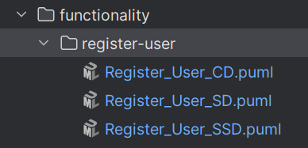
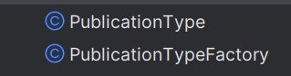
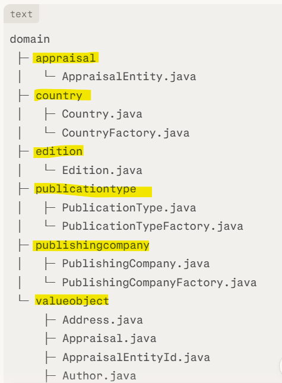
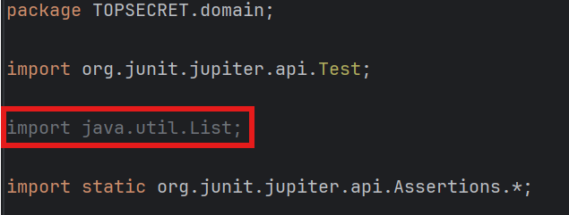
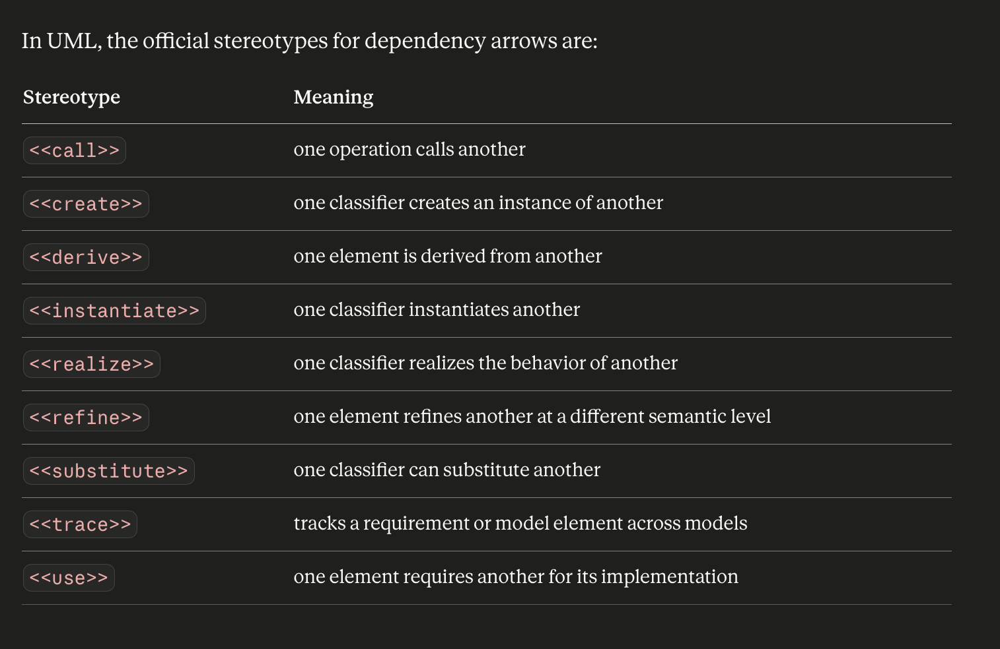
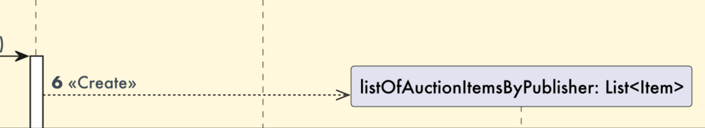
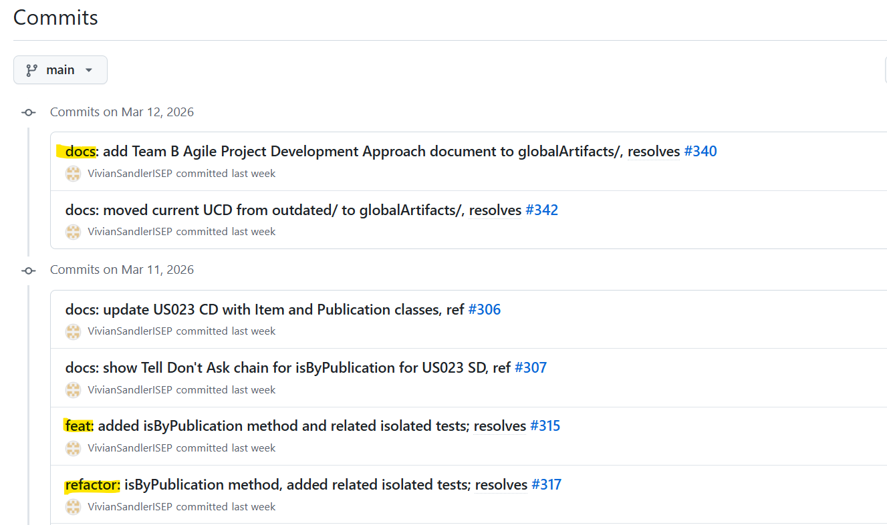

# Team B Code Structure Conventions

This document describes the conventions and best practices that must be applied to the code structure of Team B.  
The goal of these rules is to maintain consistency and efficient collaboration during project development.

---

## Index
* [1. General rules](#1-general-rules)
* [2. Implementation rules](#2-implementation-rules)
    * [2.1. Code conventions](#21-code-conventions)
    * [2.2. Factory conventions](#22-factory-conventions)
    * [2.3. Test conventions](#23-test-conventions)
* [3. How to implement](#3-how-to-implement-)
    * [3.1. Interface](#31-interface-)
    * [3.2. The equals() and sameAs() methods](#32-the-equals-and-sameas-methods-)
    * [3.3. ValueObject Interface (stamp) in classes considered VO](#33-valueobject-interface-stamp-in-classes-considered-vo)
    * [3.4. AggregateRoot Interface](#34-aggregateroot-interface)
    * [3.5. IDs that need to be generated without passing parameters](#35-ids-that-need-to-be-generated-without-passing-parameters)
    * [3.6. IRepository in the Repo interface and Mem<class>Repo](#36-irepository-in-the-repo-interface-and-memclassrepo)
* [4. Diagrams rules](#4-diagrams-rules)
    * [4.1. Organization](#41-organization)
    * [4.2. Sequence diagram](#42-sequence-diagram)
* [5. GitHub workflow](#5-github-workflow)
    * [5.1. Issue](#51-issue)
    * [5.2. Commit](#52-commit)

---


## 1. General rules

1.1. Do not submit code with errors or failures.

1.2. If the changes made in one class affect other classes, you must fix those dependencies before submitting the code.  

1.3. If you have incomplete code or are unsure about certain lines, you should comment them to indicate that they require review.

1.4. File and package naming:

- package names inside docs -> lowercase and hyphens  


- diagrams files (.puml) -> `Description_Of_Functionality_TYPEDIAGRAM.puml`  


- java class files -> camelCase  
  

- package names inside MITELOVERS -> lowercase and no spaces  
  

---


## 2. Implementation rules

### 2.1. Code conventions

2.1.1. Class attributes must use the `_` prefix

**Example:**
```java
public class AppraisalEntityRepo {
    private final List<AppraisalEntity> _appraisalEntities;
    private AppraisalEntityFactory _factoryAppraisalEntity;
}
```

2.1.2. Domain Classes with Factory, the constructors must be **package-private**.  

**Example:**  


2.1.3. Remove all unused imports.  

**Example:**  



### 2.2. Factory conventions

2.2.1. Methods in Factory classes must follow the pattern `create<ObjectName>`

**Example:**  
```java
public class AppraisalEntityFactory {
    public AppraisalEntity createAppraisalEntity(...)
```

2.2.2. Factories should only return domain objects.  

2.2.3. Do not use try-catch blocks in factories.  

2.2.4. At the moment, there are no exceptions that require specific handling.  
However, we keep references to exceptions in the JavaDoc to document the behavior of the domain class constructor.  

**Example:**  
```java
/**
 * Factory responsible for creating {@link Genre} instances.
 * <p>
 * @throws IllegalArgumentException if genreName is invalid (as defined by {@link Genre}'s constructor).
 */

public class GenreFactory {

    public Genre createGenre(String genreName) {
        return new Genre(genreName);
    }

}
```


## 2.3. Test conventions

2.3.1. Test names must use the *CamelCase* format.  

**Example:**  
```java
@Test
void shouldAddNewAppraisalEntity() {
```

2.3.2. All tests must clearly separate with AAA Pattern (Arrange, Act, Assert).  
If applicable, include SUT (System Under Test).  

**Example 1:**  
```java
class AppraisalTest {

    @Test
    void creationOfValidAppraisalShouldSucceed() {

        // Arrange
        Price priceDouble = mock(Price.class);

        // Act
        Appraisal appraisal = new Appraisal(priceDouble, _fixedDate,_validDescription);

        // Assert
        assertEquals(priceDouble, appraisal.getValueEstimate());
        assertEquals(_fixedDate, appraisal.getAppraisalDate());
        assertEquals(_validDescription, appraisal.getObjectDescription());
    }
```
**Example 2:**  
```java
class AppraisalEntityRepoTest {
@Test
    void shouldAddNewAppraisalEntity() {

        // arrange 
        when(_factoryDouble.createAppraisalEntity(_nameDouble, _publicationTypes, _genres)).thenReturn(_entityDouble);

        // SUT
        AppraisalEntityRepo repo = new AppraisalEntityRepo(_factoryDouble);

        // act
        AppraisalEntity entity = repo.registerNewAppraisalEntity(_nameDouble, _publicationTypes, _genres);

        // assert
        assertEquals(_nameDouble, entity.getName());
        assertEquals(_publicationTypes, entity.getPublicationTypes());
        assertEquals(_genres, entity.getGenres());
    }
```

**Example 3:**  
```java
class AppraisalTest {
@Test
    void constructorShouldThrowWhenAppraisalDateIsNull() {

        // Arrange
        Price priceDouble = mock(Price.class); // stub

        // Act & Assert
        assertThrows(IllegalArgumentException.class,
                () -> new Appraisal(priceDouble, null, _validDescription));
    }
```

>**NOTE:** Formatting (spaces/case) is not strict.  

2.3.3. Test Doubles naming must follow the format `<className>Double`.  

**Example:**  
```java
_genreDouble = mock(Genre.class);
```

2.3.4. Do **not** create methods inside test classes.  


## 3. How to implement  

### 3.1. Interface  

3.1.1. Create an interface inside the package `TOPSECRET/domain/repository` (right-click) -> New -> Java Class -> Interface -> I<ClassName>Repo  

3.1.2. Interface naming must follow the format `I<ClassName>Repo`

3.1.3. List all public methods defined in the `Mem<class>Repo`  

**Example:**  
```java
public interface IUserRepo {
    User registerNewUser (String name, String email);
    List<User> getAll();
}
```

3.1.4. Rename the Repo class to `Mem<ClassName>Repo` **(ONLY IN THE REPO CLASS)** and reference the implementation of the interface created in the previous step.  
Add `@Override` to the public methods referenced in the interface.  

**Example:**  
```java
public class MemoUserRepo implements IUserRepo { 
    private final List<User> _users = new ArrayList<>();
    private final UserFactory _userFactory;

    public UserRepo(UserFactory userFactory) {
        _userFactory = userFactory;
    }

    @Override
    public User registerNewUser(Name name, Email email) {

        if (userExists(email)) {
            throw new IllegalStateException("User already exists");
        }
    (...)
    }

    private boolean userExists(String email) {
        String emailFormat = email.trim().toLowerCase();

        for (User user : _users) {
            if (emailFormat.equals(user.getEmail())) {
    (...)
    }

    @Override
    public List<User> getAll() {
        return List.copyOf(_users);
    }
}
```

3.1.5. Controllers must depend on the interface, not implementation.  

**Example:**  
```java
public class RegisterNewUserController {
private final IUserRepo _iUserRepo;

    public RegisterNewUserController(IUserRepo iUserRepo, User admin) {
        _iUserRepo = iUserRepo;
    }

    public User registerNewUser(String name, String email) {
        return _iUserRepo.registerNewUser(name, email);
    }
}
```

>**NOTE:** check to see if there are any other controllers that might need to call the interface you're creating.


## 3.2. The equals() and sameAs() methods  

3.2.1. Identity-based equality - to compare objects using their IDs.  

**Example:**  
```java
@Override
    public boolean equals(Object object) {
        if (this == object)
            return true;

        if (object instanceof EditionBook) {
            EditionBook otherEditionBook = (EditionBook) object;
            return _bookId.equals(otherEditionBook._bookId);
        }
        return false;
    }
```

3.2.2. Field-based equality - used to compare objects at the time of their creation to ensure that they are distinct (even though the generated ID is always different).  
All fields of the object are compared, or at least those necessary to determine whether two instances are different or not.  

**Example:**  
```java
 @Override
    public boolean sameAs(Object object) {
        if (object instanceof EditionBook) {
            EditionBook otherEditionBook = (EditionBook) object;

            if (_bookId instanceof ISBN) {
                return _bookId.equals(otherEditionBook._bookId);
            }

            if (_publicationId.equals(otherEditionBook._publicationId) &&
                    _publishingCompanyId.equals(otherEditionBook._publishingCompanyId) &&
                    _publishingYear.equals(otherEditionBook._publishingYear) &&
                    _editionLanguage.equals(otherEditionBook._editionLanguage)) {
                return true;
            }
        }
        return false;
    }
```


## 3.3. ValueObject Interface (stamp) in classes considered VO

3.3.1. All classes that are Value Objects must implement the interface located in `TOPSECRET/ddd/ValueObject`.  

**Example:**  
```java
public class NumberOfPages implements ValueObject {
```

3.3.2. Then move the Java file into the valueobject package (`TOPSECRET/domain/valueobject`) and accept the IDE’s automatic refactoring.  

3.3.3. All classes that use this Value Object automatically receive the updated import.  

**Example:**  
```java
import TOPSECRET.domain.valueobject.Name;
```

>**NOTE:** before starting this process, ensure that the staging area and working directory are clean.  
> This way, you can clearly identify which classes are impacted by the change—making the commit clearer and more complete.


## 3.4. AggregateRoot Interface

3.4.1. Classes that have been defined as roots must implement the AggregateRoot interface.  
However, the AggregateRoot interface in our repository extends DomainEntity.  

If you look at the implementation of the DomainEntity interface, you will see that it has two methods: `ID identity()` and `boolean sameAs`.  
Therefore, when applying the AggregateRoot stamp to classes defined in this way, you must implement these two methods.  

**Example:**  
```java
public class User implements AggregateRoot<UserID> {
@Override
public UserID identity() {
    return _userId;
}
@Override
    public boolean sameAs(Object object) {
        if (!(object instanceof User other)) return false;
        return _userId.equals(other._userId);
    }
}
```

>**NOTE 1:** don’t forget to add tests for these methods.

>**NOTE 2:** in this example, UserID is being used, but in your classes, use <ClassIDName>, which was defined in Excel for your root.

3.4.2. Since there is no class named UserID, you will need to create a Java file in the package `TOPSECRET/domain/valueobject`.  

3.4.3. In this class you just created, implement DomainId.  
The DomainId interface has no methods implemented, so we don’t need to add any methods.  
In the case of User, its ID will be Email, so this UserID will be implemented as follows:  

```java
public class UserID implements DomainId {

    private final Email _email;

    public UserID(Email email) {
        _email = Objects.requireNonNull(email);
    }

    public Email getEmail() { return _email; }

    @Override
    public boolean equals(Object o) {
        if (!(o instanceof UserID other)) return false;
        return _email.equals(other._email);
    }

    @Override
    public int hashCode() {
        return _email.hashCode();
    }
}
```
>**NOTE:** in the Email class, make sure you implement the Value Object pattern.


## 3.5. IDs that need to be generated without passing parameters

3.5.1. `<Class>Id`  
```java
public final class <Class>Id implements DomainId {

    private String _id;
    
    //constructor
    public <Class>Id() {

        _id = UUID.randomUUID() //or with any other rules or customizations for your ID; 
                                // if necessary, you can create additional helper methods and call them here;
    }
```

3.5.2. `<Class>`  
```java
public class <Class> implements AggregateRoot<<Class>Id> {

    private final <ClassRandom> classRandom;
    private <Class>Id _id;

    //construtor
    <Class>(<Class>Id id, <ClassRadom> classRandom) {

        _classRandom = classRandom;
        _id = new <Class>Id();
    }
```

3.5.3. `Mem<Class>Repo`  
```java
    @Override
    public <Class> add<Class>(<ClassRandom> classRandom) {

        <Class> <class> = _factory.create<Class>(classRandom);
        _<class>.add(<class>);

        if(containsOfIdentity(<class>.identity())) {

            throw new IllegalStateException("<Class> already exists!");

        }

        return save(<class>);

    }
```

So, when the factory’s `create` method is called, a new instance is created, and a new ID is generated for it at the same time.  
Before saving it, the repo ensures that the generated ID is indeed new (meaning it doesn’t yet exist in the repo) and only saves it if it is.  

>**NOTE:** <classRandom> is any parameter you need to pass when constructing your class.  


## 3.6. IRepository in the Repo interface and Mem<class>Repo

3.6.1. In `I<class>Repo`, you must include `extends IRepository<classId, className>`.  

**Example:**
```java
public interface IAuctionRepo extends IRepository<AuctionId, Auction> {
```

>**NOTE 1:** Do not include the methods from IRepository in IAuctionRepo.

>**NOTE 2:** The **names of the methods** that perform `get` or `find` operations must be changed:
> **Example:**  
> `getAuctionItemsByAuthorId(AuthorId authorId)`;  
> `getItemsInLibraryByUserId(UserId userId)`;  
> `findLibraryByUserId(UserId userId)`;  
> `findListsByUserId(UserId userId)`;  

>**ATTENTION:** The parameters of these methods may **only** be changed for a specific ID when the person responsible for that ID makes the implementation.  
> In other words, change the method name, but **not** the parameter.  
> **Example:**
> ```java
> getAuctionItemsByPublicationId(Publication publication);
> ```


3.6.2. In `Mem<class>Repo`, you must implement the methods defined in IRepository.  

>**NOTE:** to facilitate the implementation of these methods, you should replace the `List<ClassName>` attribute with `private final Map<ClassId, ClassName> DATA;`.  
> Without it, the repository would have no internal storage, and all methods (save, findAll, ofIdentity) would have to rely on external lists or another structure.

**Example 1:**   
```java
public class MemoAuctionRepo implements IAuctionRepo {

    private final Map<AuctionId, Auction> DATA;
    private final AuctionFactory _auctionFactory;

    MemoAuctionRepo(AuctionFactory auctionFactory) {
        DATA = new HashMap<AuctionId, Auction>();
        _auctionFactory = auctionFactory;
    }
```

**OR**

**Example 2:**  
```java
public class MemoAuctionRepo implements IAuctionRepo {

    private final Map<AuctionId, Auction> DATA = new HashMap<AuctionId, Auction>();
```

3.6.3. The methods that must be implemented because of IRepository are:  
- `public T save(T entity)`;  
- `public Iterable<T> findAll()`;  
- `public Optional<T> ofIdentity(ID id)`;  
- `public boolean containsOfIdentity(ID id)`;  

**Example:**
```java
@Override
public Auction save(Auction auction) {
    DATA.put(auction.identity(), auction);
    return auction;
}

@Override
public Iterable<Auction> findAll() {
    return DATA.values();
}

@Override
public Optional<Auction> ofIdentity(AuctionId id) {
    if(!containsOfIdentity(id)) {

        return Optional.empty();

    } else {

        return Optional.of(DATA.get(id));
    }

    @Override
    public boolean containsOfIdentity(AuctionId id) {
        return DATA.containsKey(id);
    }
```

>**NOTE 1:** Do not forget to test these methods.

>**WARNING:** These new methods may replace or modify existing methods in your `Mem<class>Repo` class.


## 4. Diagrams rules

### 4.1. Organization

4.1.1.When creating the diagrams (`docs/userStories/`), if there are multiple versions, and you do not intend to update them, you should create a folder named `outdated/` and move the versions that will not be used in this sprint into it.

**Example:**


4.1.2. Diagrams files naming must follow the format `US0XX_description_CD.puml`  

**Example:**  


4.1.3. Official UML Stereotypes  



### 4.2. Sequence diagram

4.2.1. Add `<<Create>>` to indicate the instantiation of the new object.  
Pay close attention to the arrow type (`-->>`).  

**Example:**


4.2.2. For long class, method, message names, we should use line breaks.

**Example:**  
title US002 - “As an administrator, I want to add a publication type to the official type list, **%n()** so that new publications can be of this type” - Level 2 SD

Ctl -> Interface: addPublicationType **%n()** (publicationTypeName)


4.2.3. Repo references in diagrams:
- `I<class>Repo`: If the operation is simple (getAll, request/return), we should use the Repo interface;
- `Memo<class>Repo`: If the operation involves more complex logic (OPT, a boolean to check for existence before performing further actions), we should use `Memo<class>Repo`, since it contains the information needed for those actions.


## 5. GitHub workflow

### 5.1. Issue

5.1.1. Whenever you want to start a new task, you must create a corresponding Issue.  

**Example:**  
If you are refactoring a class, you must create a specific Issue for that refactoring before starting the work.  


### 5.2. Commit

5.2.1. Start adding appropriate git commit prefixes (good practice and helps organize our commits).  

**Example:**
Other prefixes include
fix:
test:
minor:
...


(see list here: https://gist.github.com/johnstew/941676d525271359a4b2d7f1bf2cb421) 
