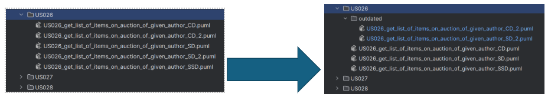
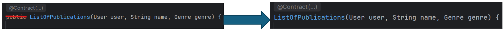

# Team B Code Structure Conventions

This document describes the conventions and best practices that must be applied to the code structure of Team B.  
The goal of these rules is to maintain consistency and efficient collaboration during project development.

---

### 1. Do not submit code with errors or failures

1.1. If the changes made in one class affect other classes, you must fix those dependencies before submitting the code.

1.2. If you have incomplete code or are unsure about certain lines, you should comment them to indicate that they require review.

---

### 2. Methods in Factory classes must follow the pattern `create<ObjectName>`

**Example:**

```java
public class AppraisalEntityFactory {
    public AppraisalEntity createAppraisalEntity(...) {
```

### 3. Class attributes must use the `_` prefix

**Example:**
```java
public class AppraisalEntityRepo {
    private final List<AppraisalEntity> _appraisalEntities;
    private AppraisalEntityFactory _factoryAppraisalEntity;
}
```

### 4. Whenever you want to start a new task, you must create a corresponding Issue

**Example:**  
If you are refactoring a class, you must create a specific Issue for that refactoring before starting the work.

### 5. Test names must use the *CamelCase* format

**Example:**
```java
@Test
void shouldAddNewAppraisalEntity() {
```

### 6. In isolation tests, when creating doubles, dependency names must follow the format `_<ClassName>Double`

**Example:**
```java
_genreDouble = mock(Genre.class);
when(_genreDouble.getGenre()).thenReturn("Self-Help");
```

### 7. In Factory classes we only return the domain object and do not use try-catch blocks

At the moment, there are no exceptions that require specific handling.
However, we keep references to exceptions in the JavaDoc to document the behavior of the domain class constructor.

**Example:**
```java
/**
* Factory responsible for creating {@link Genre} instances.
*
* @throws IllegalArgumentException if genreName is invalid (as defined by {@link Genre}'s constructor).
  */
  public class GenreFactory {

    public Genre createGenre(String genreName) {
        return new Genre(genreName);
    }
  }
```
### 8. When creating diagrams (`docs/userStories/`)

If multiple versions exist, and you do not intend to update them, create a folder called outdated/ and move the versions that will not be used in that sprint into it.

**Example:**  



### 9. In test classes, you must reference which parts correspond to Arrange, Act, and Assert

If the class is a Repo or Controller, also reference the SUT.

**Example 1:**
```java
class AppraisalTest {

    @Test
    void creationOfValidAppraisalShouldSucceed() {

        // Arrange
        Price priceDouble = mock(Price.class);

        // Act
        Appraisal appraisal = new Appraisal(priceDouble, _fixedDate, _validDescription);

        // Assert
        assertEquals(priceDouble, appraisal.getValueEstimate());
        assertEquals(_fixedDate, appraisal.getAppraisalDate());
        assertEquals(_validDescription, appraisal.getObjectDescription());
    }
}
```

**Example 2:**
```java
class AppraisalEntityRepoTest {

    @Test
    void shouldAddNewAppraisalEntity() {

        // arrange
        when(_factoryDouble.createAppraisalEntity(_nameDouble, _publicationTypes, _genres))
                .thenReturn(_entityDouble);

        // SUT
        AppraisalEntityRepo repo = new AppraisalEntityRepo(_factoryDouble);

        // act
        AppraisalEntity entity = repo.registerNewAppraisalEntity(_nameDouble, _publicationTypes, _genres);

        // assert
        assertEquals(_nameDouble, entity.getName());
        assertEquals(_publicationTypes, entity.getPublicationTypes());
        assertEquals(_genres, entity.getGenres());
    }
}
```

**Example 3:**
```java
class AppraisalTest {

    @Test
    void constructorShouldThrowWhenAppraisalDateIsNull() {

        // Arrange
        Price priceDouble = mock(Price.class); // stub

        // Act & Assert
        assertThrows(IllegalArgumentException.class,
                () -> new Appraisal(priceDouble, null, _validDescription));
    }
}
```

### 10. Remove imports that are not being used


### 11. In domain classes that have a Factory, constructors must be set to `package-private`

Example:


